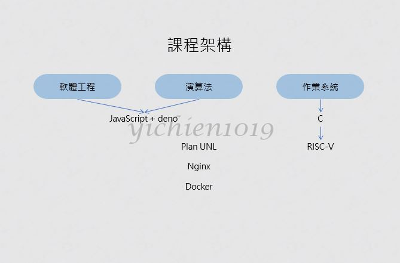
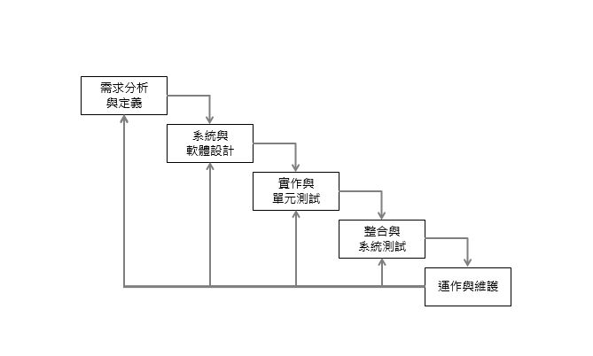
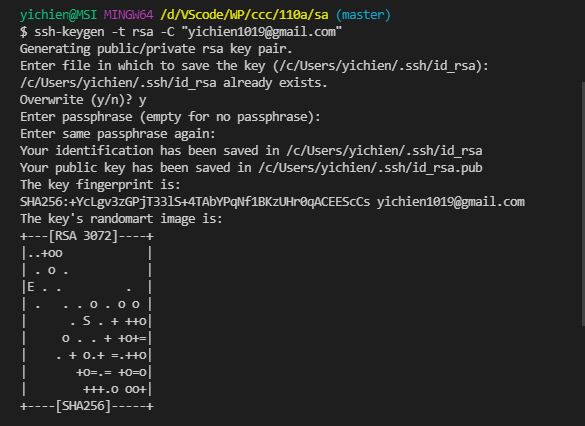
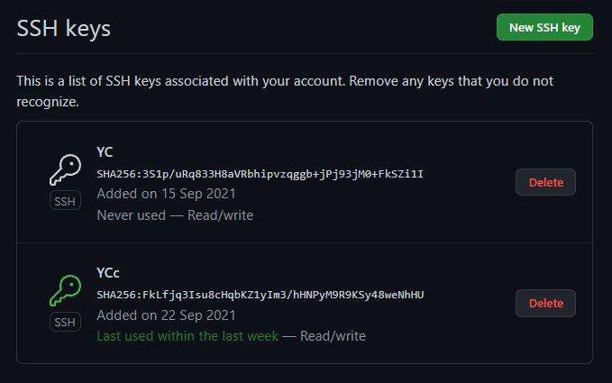
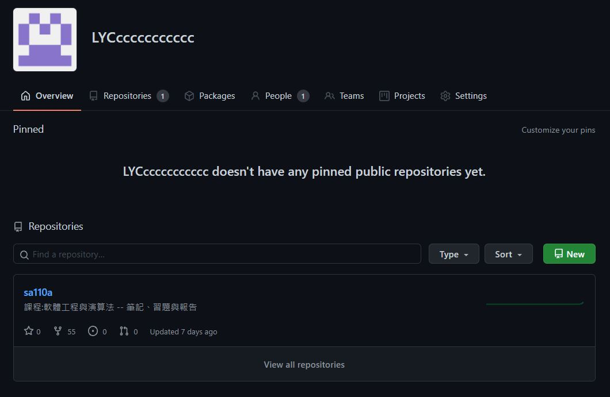
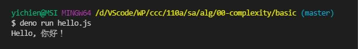
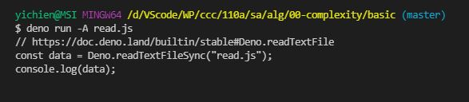

# 📝軟體工程與演算法第一週筆記20210915
## 👉成績評定
* 期中成績(=筆記) 30%
* 期末成績(=專案) 30%
* 平時成績(=隋堂作業) 40%

## 📖 課程內容

* 軟體工程
    * JavaScript
* 演算法
    * Deno
    * Plant UML
    * nginx
    * Docker
* 作業系統
    * C
    * RISC-V

## 📖 什麼是[軟體工程](https://zh.wikipedia.org/zh-tw/%E8%BD%AF%E4%BB%B6%E5%B7%A5%E7%A8%8B)

* 軟體工程是一門研究用工程化方式建構和維護有效的、實用的和高質量的軟體的學科。他涉及到程式設計語言、資料庫、軟體開發工程、系統平台、標準、設計等模式方面。
### 🔖 模型簡介
#### [瀑布模型](https://zh.wikipedia.org/wiki/%E7%80%91%E5%B8%83%E6%A8%A1%E5%9E%8B)

#### [螺旋模型](https://zh.wikipedia.org/wiki/%E8%9E%BA%E6%97%8B%E6%A8%A1%E5%9E%8B)


## 📖 GITHUB如何加入[ssh key設定](https://programmermedia.org/root/%E9%99%B3%E9%8D%BE%E8%AA%A0/%E6%8A%80%E8%83%BD/git.md)
* github 從 2021 年八月開始強制安裝 ssh key 提升安全性

```
yichien@MSI MINGW64 /d/VScode/WP/ccc/110a/sa (master)
$ ssh-keygen -t rsa -C "yichien1019@gmail.com"

yichien@MSI MINGW64 /d/VScode/WP/ccc/110a/sa (master)
$ cat /c/Users/yichien/.ssh/id_rsa.pub
```
* 將公鑰複製下來，貼到Setting -> SSH and GPG keys -> New SSH key，完成設定


## 📖 創建GITHUB 的 Organization

1. 進入github的settings點擊organizations
2. 命名(不能重複)並創建，也可以邀請隊員進入組織

## 📖 什麼是[DENO](https://zh.wikipedia.org/wiki/Deno)

* Deno 是由人稱 Node.js 之父的 Ryan Dahl 在 2018年的演講 「10 Things I Regret About Node.js」中提出的專案。主要是想修正當初在開發 Node.js 時的缺點
* Deno 與 Node.js 一樣是基於 V8 引擎，並且是由 Rust 語言(Node.js 使用 C++)建構的 JavaScript 與 TypeScript 執行環境
### 🔖 與 Node.js 不同的特色:
* 支援 TypeScript
* 支援 ES6 import 與其他新的語法
* URL import (不再需要 npm 與 node_modules 了)
* Security
### 🔖 執行指令
#### 執行專案的指令
* `$ deno run 檔案名.副檔名` <br>
>EX : `$ deno run hello.js`
#### 太久沒執行專案的指令
* `$ deno run --allow-read 檔案名.副檔名` or `$ deno run -A 檔案名.副檔名`
>EX : `$ deno run --allow-read read.js` or `$ deno run -A read.js`

## 💻 程式實際操作
### 🔗 alg/00-complexity/basic/hello.js

#### The result of execution
```
yichien@MSI MINGW64 /d/VScode/WP/ccc/110a/sa/alg/00-complexity/basic (master)  
$ deno run hello.js
Hello, 你好！
```

### 🔗 alg/00-complexity/basic/read.js

#### The result of execution
```
yichien@MSI MINGW64 /d/VScode/WP/ccc/110a/sa/alg/00-complexity/basic (master)   
$ deno run -A read.js
// https://doc.deno.land/builtin/stable#Deno.readTextFile
const data = Deno.readTextFileSync("read.js");
console.log(data);
```

## 📖 補充資料
* [ccckmit 用20分鐘搞懂 《系統分析、軟體工程、專案管理與設計模式》](https://www.slideshare.net/ccckmit/20-57269452)
* [初探 Deno — 與 Node.js 的淺比較](https://oldmo860617.medium.com/%E5%88%9D%E6%8E%A2-deno-%E8%88%87-node-js-%E7%9A%84%E6%B7%BA%E6%AF%94%E8%BC%83-19e8c6cbb249)
* [bigo](https://www.bigocheatsheet.com/)