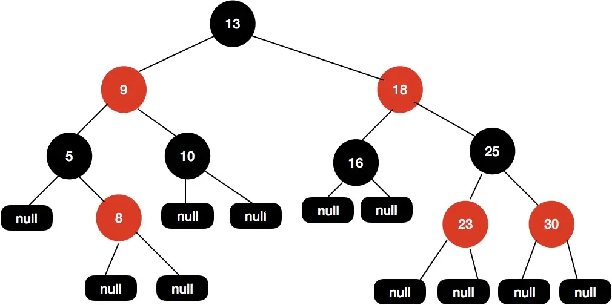
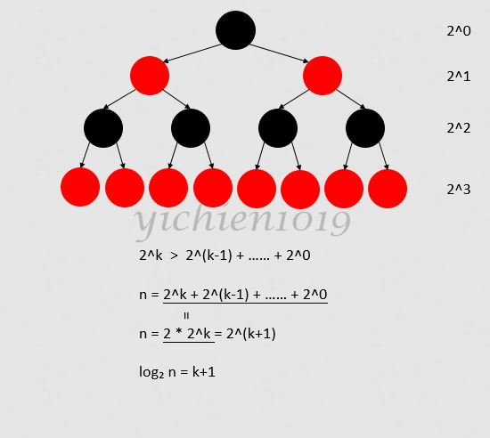
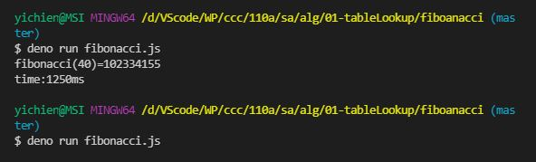
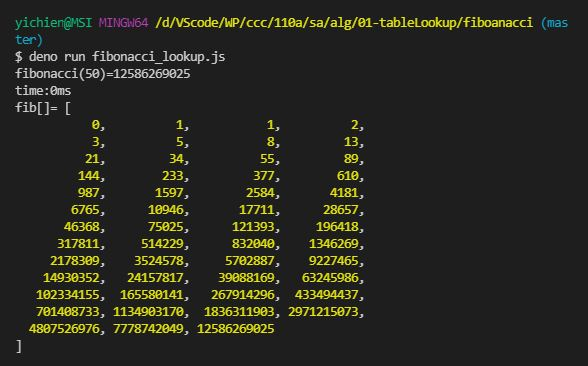
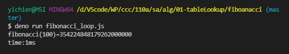

# 📝軟體工程與演算法第二週筆記20210922
## 📖 
### 🔖 
#### 📍 
## 📖 [紅黑樹(Red–black tree)](https://zh.wikipedia.org/wiki/%E7%BA%A2%E9%BB%91%E6%A0%91)
* 紅黑樹是一種自平衡二元搜尋樹，是在電腦科學中用到的一種資料結構，典型用途是實現關聯陣列。
* 它的操作有著良好的最壞情況執行時間，並且在實踐中高效：它可以在Big-O(log n)時間內完成尋找、插入和刪除，這裡的n是樹中元素的數目。

### 🔖 紅黑樹性質
1. 節點是紅色或黑色
2. 根節點是黑色
3. 每個葉節點（NIL或者空節點）是黑色
4. 如果一個節點是紅色，則它的兩個子節點都是黑色
5. 對於每個節點，從該節點到其所有後代葉節點的路徑上，均包含相同數目的黑色節點
#### 📍 補充說明


## 📖 [巴斯卡三角形](https://zh.wikipedia.org/wiki/%E6%9D%A8%E8%BE%89%E4%B8%89%E8%A7%92%E5%BD%A2)

* 巴斯卡三角形第 n 層（頂層稱第 0 層，第 1 行，第 n 層即第 n+1 行，此處n 為包含 0 在內的自然數）正好對應於二項式 (a+b)^n展開的係數。例如第二層 1 2 1 是冪指數為 2 的二項式 (a+b)^2 展開形式 a^{2}+2ab+b^{2}的係數
### 🔖 
#### 📍

## 💻 程式實際操作
### 🔗 sa/alg/01-tableLookup/fiboanacci/fiboanacci.js

<details>
  <summary><b>Show code</b></summary>

  ```
function fibonacci (n) {
  if (n < 0) throw Error('fibonacci:n < 0')
  if (n === 0) return 0
  if (n === 1) return 1
  return fibonacci(n - 1) + fibonacci(n - 2)
}

var startTime = Date.now()
const n = 50
console.log(`fibonacci(${n})=${fibonacci(n)}`)
var endTime = Date.now()
var milliSeconds = endTime - startTime
console.log(`time:${milliSeconds}ms`)
  ```
</details> 

* 嚴格相等(===)比較兩個值，而被比較的兩個值都不會轉換成其他型別。如果值是不同型別，就會被視為不相等。如果兩值型別相同但不是數字，若值相同，則為相等。

#### The result of execution ( 📍 Big-O(2^n))
* fiboanacci(40)是電腦可運算範圍極限，所以fiboanacci(50)會跑不動
```
yichien@MSI MINGW64 /d/VScode/WP/ccc/110a/sa/alg/01-tableLookup/fiboanacci (master)
$ deno run fibonacci.js                                                        
fibonacci(40)=102334155
time:1250ms

yichien@MSI MINGW64 /d/VScode/WP/ccc/110a/sa/alg/01-tableLookup/fiboanacci (master)
$ deno run fibonacci.js
```

### 🔗 sa/alg/01-tableLookup/fiboanacci/fibonacci_lookup.js

<details>
  <summary><b>Show code</b></summary>

  ```
var fib = [0, 1]

function fibonacci (n) {
  if (n < 0) throw Error('fibonacci:n < 0')
  if (fib[n] != null) return fib[n]
  fib[n] = fibonacci(n - 1) + fibonacci(n - 2) 
  return fib[n]
}

var startTime = Date.now()
const n = 50 
console.log(`fibonacci(${n})=${fibonacci(n)}`)
var endTime = Date.now()
var milliSeconds = endTime - startTime
console.log(`time:${milliSeconds}ms`)
console.log('fib[]=', fib)
  ```
</details>

* 利用array紀錄，再用查找字典方式查詢，之接回傳數值，減少運算次數

#### The result of execution( 📍 Big-O(n))
* 加入了`fib[]`，將運算過的結果紀錄下來，可以增加運算的速度
```
yichien@MSI MINGW64 /d/VScode/WP/ccc/110a/sa/alg/01-tableLookup/fiboanacci (master)
$ deno run fibonacci_lookup.js 
fibonacci(50)=12586269025
time:0ms
fib[]= [
           0,          1,           1,          2,
           3,          5,           8,         13,
          21,         34,          55,         89,
         144,        233,         377,        610,
         987,       1597,        2584,       4181,
        6765,      10946,       17711,      28657,
       46368,      75025,      121393,     196418,
      317811,     514229,      832040,    1346269,
     2178309,    3524578,     5702887,    9227465,
    14930352,   24157817,    39088169,   63245986,
   102334155,  165580141,   267914296,  433494437,
   701408733, 1134903170,  1836311903, 2971215073,
  4807526976, 7778742049, 12586269025
]
```

### 🔗 sa/alg/01-tableLookup/fiboanacci/fibonacci_loop.js

<details>
  <summary><b>Show code</b></summary>

  ```
function fibonacci (n) {
  if (n===0) return 0
  if (n===1) return 1
  var fi2 = 0, fi1 = 1 // f(0)=0, f(1)=1
  for (var i=2; i<=n; i++) {
    var fi = fi1+fi2
    fi2 = fi1
    fi1 = fi
  }
  return fi
}

var startTime = Date.now()
const n = 100
console.log(`fibonacci(${n})=${fibonacci(n)}`)
var endTime = Date.now()
var milliSeconds = endTime - startTime
console.log(`time:${milliSeconds}ms`)
  ```
</details>

#### The result of execution( 📍 Big-O(n))
* 遞迴的執行速度最快
```
yichien@MSI MINGW64 /d/VScode/WP/ccc/110a/sa/alg/01-tableLookup/fiboanacci (master)
$ deno run fibonacci_loop.js
fibonacci(100)=354224848179262000000
time:1ms
```

### 🔗 
#### The result of execution
```
```

### 🔗 
#### The result of execution
```
```


## 📖 補充資料
* [資料結構與演算法：紅黑樹（Red Black Tree）](https://www.itread01.com/content/1546725999.html)
* [紅黑樹（Red Black Tree）介紹](https://tigercosmos.xyz/post/2019/11/algorithm/red-black-tree/)