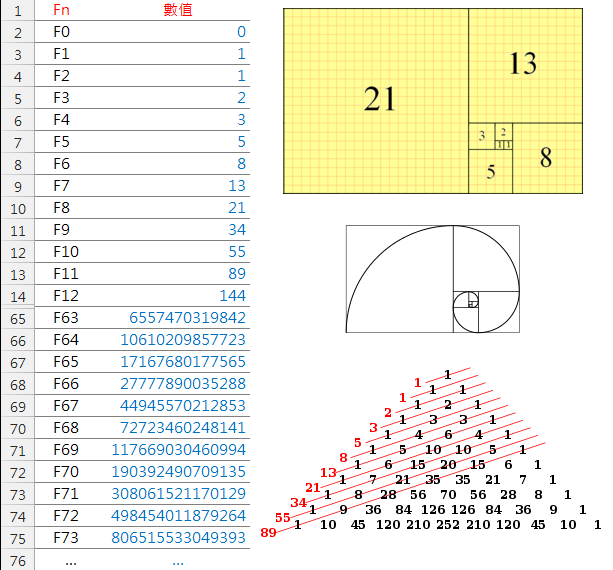
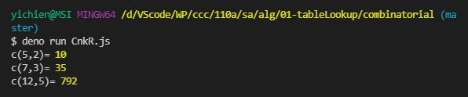
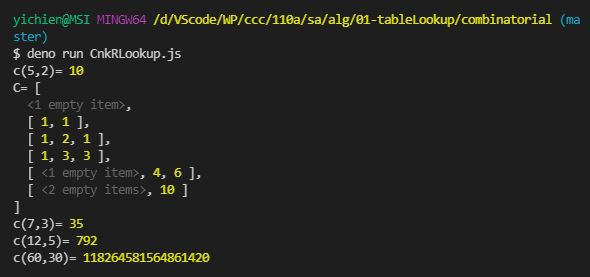
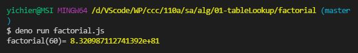
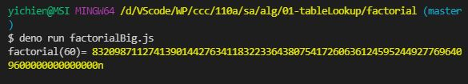

# 📝軟體工程與演算法第二週筆記20210922
## 📖 [紅黑樹(Red–black tree)](https://zh.wikipedia.org/wiki/%E7%BA%A2%E9%BB%91%E6%A0%91)
* 紅黑樹是一種自平衡二元搜尋樹，是在電腦科學中用到的一種資料結構，典型用途是實現關聯陣列。
* 它的操作有著良好的最壞情況執行時間，並且在實踐中高效：它可以在Big-O(log n)時間內完成尋找、插入和刪除，這裡的n是樹中元素的數目。

### 🔖 紅黑樹性質
1. 節點是紅色或黑色
2. 根節點是黑色
3. 每個葉節點（NIL或者空節點）是黑色
4. 如果一個節點是紅色，則它的兩個子節點都是黑色
5. 對於每個節點，從該節點到其所有後代葉節點的路徑上，均包含相同數目的黑色節點
#### 📍 補充說明


## 📖 [巴斯卡三角形](https://zh.wikipedia.org/wiki/%E6%9D%A8%E8%BE%89%E4%B8%89%E8%A7%92%E5%BD%A2)

* 巴斯卡三角形第 n 層（頂層稱第 0 層，第 1 行，第 n 層即第 n+1 行，此處n 為包含 0 在內的自然數）正好對應於二項式 (a+b)^n展開的係數。例如第二層 1 2 1 是冪指數為 2 的二項式 (a+b)^2 展開形式 (a^2 + 2ab + b^2) 的係數
```
　　　　　　   1
　　　　　　　1　1
　　　　　　1  2　1
　　　　　1　3　 3　1
　　　　1　 4　6　4 　1
　　　1　5　10　10　5　1
　　1　6　15　20　15　6　1
　1　7　21　35　35　21　7　1
1　8　28　56　70　56　28　8　1
```

## 📖 [費氏數列](https://zh-yue.wikipedia.org/wiki/%E8%B2%BB%E6%B0%8F%E6%95%B8%E5%88%97)

### 🔖 定義
* f(0) = 0
* f(1) = 1
* f(n) = f(n-1) + f(n-2)
* 數列 : 1, 1, 2, 3, 5, 8, 13, 21, 34, 55......

## 📖 傳統作法 & BDD & TDD
### 🔖 傳統作法
* 先寫程式再寫測試
### 🔖 BDD (Behavior-driven Development 行為驅動開發)
* BDD 是 TDD 的進化版，在寫測試前先寫測試規格書，這份規格不是單純的敘述文件，而是一份「可以被執行的規格」
* 因為其程式語法描述其極接近日常口語，相當簡單易懂，也可以執行，所以可以讓非技術人員一起參與討論
### 🔖 TDD (Test-driven Development 測試驅動開發)
* 先寫測試再寫開發程式
* 依循「紅燈／綠燈／重構」循環
* 優點是在初期就確保測試程式的撰寫，而且更容易在初期定義出更貼近使用方的介面
* 缺點是所撰寫出來的測試案例是一連串程式碼，過於偏重技術人員，不利與其他非技術的專案參與者討論

## 💻 程式實際操作
### 🔗 alg/01-tableLookup/fiboanacci/fiboanacci.js

<details>
  <summary><b>Show code</b></summary>

  ```
function fibonacci (n) {
  if (n < 0) throw Error('fibonacci:n < 0')
  if (n === 0) return 0
  if (n === 1) return 1
  return fibonacci(n - 1) + fibonacci(n - 2)
}

var startTime = Date.now()
const n = 50
console.log(`fibonacci(${n})=${fibonacci(n)}`)
var endTime = Date.now()
var milliSeconds = endTime - startTime
console.log(`time:${milliSeconds}ms`)
  ```
</details> 

* 嚴格相等(===)比較兩個值，而被比較的兩個值都不會轉換成其他型別。如果值是不同型別，就會被視為不相等。如果兩值型別相同但不是數字，若值相同，則為相等。

#### The result of execution ( 📍 Big-O(2^n))
* fiboanacci(40)是電腦可運算範圍極限，所以fiboanacci(50)會跑不動
```
yichien@MSI MINGW64 /d/VScode/WP/ccc/110a/sa/alg/01-tableLookup/fiboanacci (master)
$ deno run fibonacci.js                                                        
fibonacci(40)=102334155
time:1250ms

yichien@MSI MINGW64 /d/VScode/WP/ccc/110a/sa/alg/01-tableLookup/fiboanacci (master)
$ deno run fibonacci.js
```

### 🔗 alg/01-tableLookup/fiboanacci/fibonacci_lookup.js

<details>
  <summary><b>Show code</b></summary>

  ```
var fib = [0, 1]

function fibonacci (n) {
  if (n < 0) throw Error('fibonacci:n < 0')
  if (fib[n] != null) return fib[n]
  fib[n] = fibonacci(n - 1) + fibonacci(n - 2) 
  return fib[n]
}

var startTime = Date.now()
const n = 50 
console.log(`fibonacci(${n})=${fibonacci(n)}`)
var endTime = Date.now()
var milliSeconds = endTime - startTime
console.log(`time:${milliSeconds}ms`)
console.log('fib[]=', fib)
  ```
</details>

* 利用array紀錄，再用查找字典方式查詢，之接回傳數值，減少運算次數

#### The result of execution( 📍 Big-O(n))
* 加入了`fib[]`，將運算過的結果紀錄下來，可以增加運算的速度
```
yichien@MSI MINGW64 /d/VScode/WP/ccc/110a/sa/alg/01-tableLookup/fiboanacci (master)
$ deno run fibonacci_lookup.js 
fibonacci(50)=12586269025
time:0ms
fib[]= [
           0,          1,           1,          2,
           3,          5,           8,         13,
          21,         34,          55,         89,
         144,        233,         377,        610,
         987,       1597,        2584,       4181,
        6765,      10946,       17711,      28657,
       46368,      75025,      121393,     196418,
      317811,     514229,      832040,    1346269,
     2178309,    3524578,     5702887,    9227465,
    14930352,   24157817,    39088169,   63245986,
   102334155,  165580141,   267914296,  433494437,
   701408733, 1134903170,  1836311903, 2971215073,
  4807526976, 7778742049, 12586269025
]
```

### 🔗 alg/01-tableLookup/fiboanacci/fibonacci_loop.js

<details>
  <summary><b>Show code</b></summary>

  ```
function fibonacci (n) {
  if (n===0) return 0
  if (n===1) return 1
  var fi2 = 0, fi1 = 1 // f(0)=0, f(1)=1
  for (var i=2; i<=n; i++) {
    var fi = fi1+fi2
    fi2 = fi1
    fi1 = fi
  }
  return fi
}

var startTime = Date.now()
const n = 100
console.log(`fibonacci(${n})=${fibonacci(n)}`)
var endTime = Date.now()
var milliSeconds = endTime - startTime
console.log(`time:${milliSeconds}ms`)
  ```
</details>

#### The result of execution( 📍 Big-O(n))
* 遞迴的執行速度最快
```
yichien@MSI MINGW64 /d/VScode/WP/ccc/110a/sa/alg/01-tableLookup/fiboanacci (master)
$ deno run fibonacci_loop.js
fibonacci(100)=354224848179262000000
time:1ms
```

### 🔗 alg/01-tableLookup/combinatorial/CnkR.js

<details>
  <summary><b>Show code</b></summary>

  ```
function c(n, k) {
  if (k==0 || k==n) return 1
  return c(n-1, k) + c(n-1, k-1)
}

console.log("c(5,2)=", c(5,2))
console.log("c(7,3)=", c(7,3))
console.log("c(12,5)=", c(12,5))
console.log("c(60,30)=", c(60,30))

  ```
</details>

#### The result of execution
```
yichien@MSI MINGW64 /d/VScode/WP/ccc/110a/sa/alg/01-tableLookup/combinatorial (master)
$ deno run CnkR.js
c(5,2)= 10
c(7,3)= 35  
c(12,5)= 792
```

### 🔗 alg/01-tableLookup/combinatorial/CnkRLookup.js 

<details>
  <summary><b>Show code</b></summary>

  ```
var C = []

function c(n, k) {
  if (C[n] == null) C[n] = []
  if (C[n][k] != null) return C[n][k]
  if (k==0 || k==n)
    C[n][k] = 1
  else 
    C[n][k] = c(n-1,k) + c(n-1, k-1)
  return C[n][k]
}

console.log("c(5,2)=", c(5,2))
console.log("C=", C);
console.log("c(7,3)=", c(7,3))
console.log("c(12,5)=", c(12,5))
console.log("c(60,30)=", c(60,30))
  ```
</details>

#### The result of execution
```
yichien@MSI MINGW64 /d/VScode/WP/ccc/110a/sa/alg/01-tableLookup/combinatorial (master)
$ deno run CnkRLookup.js 
c(5,2)= 10
C= [
  <1 empty item>,
  [ 1, 1 ],
  [ 1, 2, 1 ],
  [ 1, 3, 3 ],
  [ <1 empty item>, 4, 6 ],
  [ <2 empty items>, 10 ]  
]
c(7,3)= 35
c(12,5)= 792
c(60,30)= 118264581564861420
```

### 🔗 alg/01-tableLookup/combinatorial/Cnk.js 

* 排列組合之組合
<details>
  <summary><b>Show code</b></summary>

  ```
function factorial(n) {
  var p = 1
  for (let i=1; i<=n; i++) {
    p = p * i;
  }
  return p
}

function c(n, k) {
  return factorial(n) / (factorial(k)*factorial(n-k))
}

console.log("c(5,2)=", c(5,2))
console.log("c(7,3)=", c(7,3))
console.log("c(12,5)=", c(12,5))
console.log("c(60,30)=", c(60,30))
  ```
</details>

#### The result of execution
* 超過整數範圍精準度不正確，會有誤差!!!(因為大整數)
```
yichien@MSI MINGW64 /d/VScode/WP/ccc/110a/sa/alg/01-tableLookup/combinatorial (master)
$ deno run Cnk.js 
c(5,2)= 10
c(7,3)= 35
c(12,5)= 792
c(60,30)= 118264581564861470
```

### 🔗 alg/01-tableLookup/combinatorial/CnkBig.js

<details>
  <summary><b>Show code</b></summary>

  ```
function factorial(n) {
  var p = 1n
  for (let i=1n; i<=n; i++) {
    p = p * i;
  }
  return p
}

function c(n, k) {
  return factorial(n) / (factorial(k)*factorial(n-k))
}

console.log("c(5,2)=", c(5,2))
console.log("c(7,3)=", c(7,3))
console.log("c(12,5)=", c(12,5))
console.log("c(60,30)=", c(60,30))
console.log("c(600,300)=", c(600,300))
  ```
</details>   

#### The result of execution
* BigInt 是透過在一個數值後加上 n ，例如 10n ，或呼叫 BigInt() 所生成的
```
yichien@MSI MINGW64 /d/VScode/WP/ccc/110a/sa/alg/01-tableLookup/combinatorial (master)
$ deno run CnkBig.js 
c(5,2)= 10n
c(7,3)= 35n
c(12,5)= 792n
c(60,30)= 118264581564861424n
c(600,300)= 135107941996194268514474877978504530397233945449193479925965721786474150408005716961950480198274469818673334131365837249043900490761151591695308427048536947621976068789875968372656n
```

### 🔗alg/01-tableLookup/factorial/factorial.js  

<details>
  <summary><b>Show code</b></summary>

  ```
function factorial(n) {
  var p = 1
  for (let i=1; i<=n; i++) {
    p = p * i;
  }
  return p
}

console.log('factorial(60)=', factorial(60))
  ```
</details>

* 算階層，例如 : 5!=5*4*3*2*1 = 120

#### The result of execution
```
yichien@MSI MINGW64 /d/VScode/WP/ccc/110a/sa/alg/01-tableLookup/factorial (master)
$ deno run factorial.js 
factorial(60)= 8.320987112741392e+81
```

### 🔗 alg/01-tableLookup/factorial/factorialBig.js

<details>
  <summary><b>Show code</b></summary>

  ```
function factorial(n) {
  var p = 1n
  for (let i=1n; i<=n; i++) {
    p = p * i;
  }
  return p
}

console.log('factorial(60)=', factorial(60n))
  ```
</details>

#### The result of execution
* BigInt 是一個內建的物件，提供了表示大於2^53的整數的功能 (2^53是JavaScript原生的Number能夠表示的最大值)
* BigInt 是透過在一個數值後加上 n ，例如 10n ，或呼叫 BigInt() 所生成的
```
yichien@MSI MINGW64 /d/VScode/WP/ccc/110a/sa/alg/01-tableLookup/factorial (master)
$ deno run factorialBig.js 
factorial(60)= 8320987112741390144276341183223364380754172606361245952449277696409600000000000000n
```

## 📖 補充資料
* [資料結構與演算法：紅黑樹（Red Black Tree）](https://www.itread01.com/content/1546725999.html)
* [紅黑樹（Red Black Tree）介紹](https://tigercosmos.xyz/post/2019/11/algorithm/red-black-tree/)
* [補充:巴斯卡定理」有什麼意義？]
](https://tpdjdje0525.medium.com/%E5%B7%B4%E6%96%AF%E5%8D%A1%E5%AE%9A%E7%90%86-%E6%9C%89%E4%BB%80%E9%BA%BC%E6%84%8F%E7%BE%A9-21690183d2d1)
* [BigInt](https://developer.mozilla.org/zh-TW/docs/Web/JavaScript/Reference/Global_Objects/BigInt)
* [為什麼 Float和Double會有誤差 (浮點數儲存原理)](https://dotblogs.com.tw/daniel/2018/11/10/161148)
* [TDD/BDD and Test Double](https://medium.com/hobo-engineer/ricky%E7%AD%86%E8%A8%98-tdd-bdd-and-test-double-76eee9e75092)