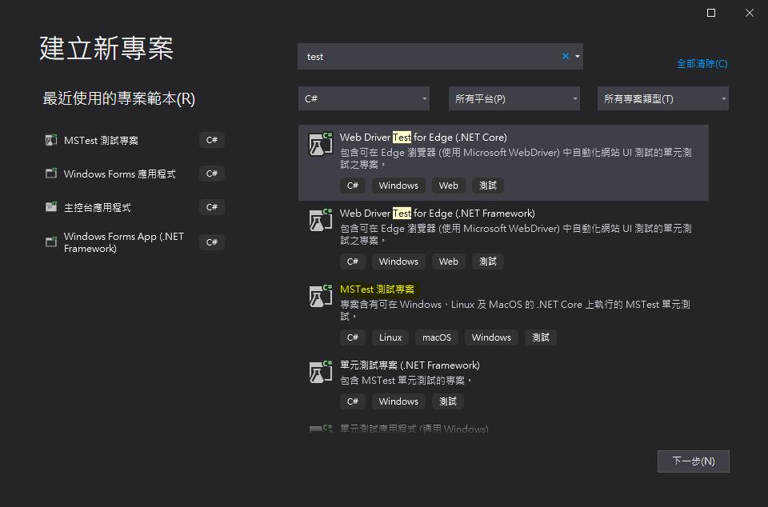
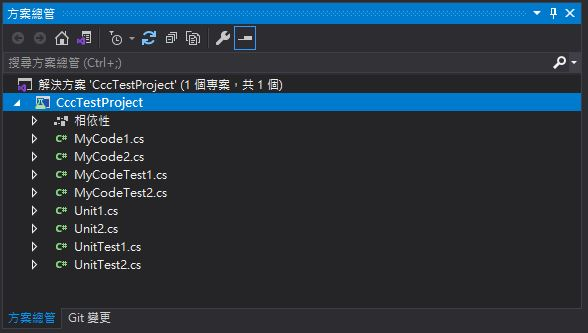
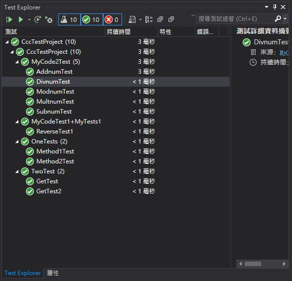
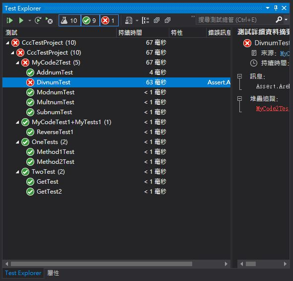
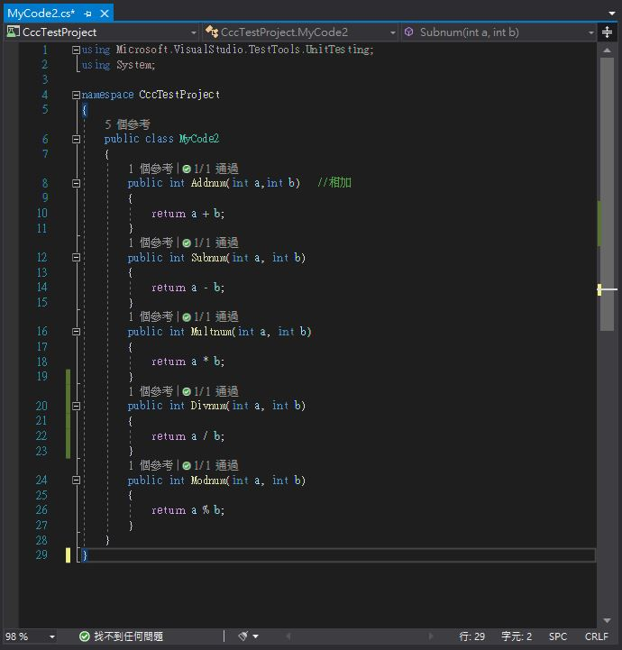

# 📝 期末作業
## 📖 簡介
>作者 : 劉怡謙<br>
>學號 : 110810519<br>
>班級 : 資工三<br>
>主題 : Unit Test in Visual Studio <br>
>作品 : 本專案非100%原創，有參考資料輔助理解，理解後有自己寫(MyCode2)<br>
>授權申明 : 
>>* [My_LICENSE](LICENSE.md)


## 📖 C#單元測試
### 🔖 如何建立測試專案
* 新增專案 > 選擇MSTest 測試專案 > 建立
* [MSTest 官方介紹](https://docs.microsoft.com/zh-tw/dotnet/core/testing/unit-testing-with-mstest)

* 建置完成 <br>

### 🔖 寫測試程式
* 自己試寫的[MyCode2](https://github.com/yichien1019/sa110a/blob/master/my_final_project/CccTestProject/CccTestProject/MyCode2.cs)
```
using Microsoft.VisualStudio.TestTools.UnitTesting;
using System;

namespace CccTestProject
{
    public class MyCode2
    {
        public int Addnum(int a,int b)   //�ۥ[
        {
            return a + b;
        }
        public int Subnum(int a, int b)   
        {
            return a - b;
        }
        public int Multnum(int a, int b)   
        {
            return a * b;
        }
        public int Divnum(int a, int b)
        {
            return a / b;
        }
        public int Modnum(int a, int b)   
        {
            return a % b;
        }
    }
}
```

### 🔖 寫單元測試
* [MyCode2的測試檔](https://github.com/yichien1019/sa110a/blob/master/my_final_project/CccTestProject/CccTestProject/MyCodeTest2.cs)
```
using Microsoft.VisualStudio.TestTools.UnitTesting;

namespace CccTestProject
{
    [TestClass()]
    public class MyCode2Test
    {
        //public int a, b;
        [TestMethod()]
        
        public void AddnumTest()
        {
            //assert
            var Sut = new MyCode2();
            var expected = 15;
            //arrange
            var actual = Sut.Addnum(10,5);
            //act
            Assert.AreEqual(expected, actual);
        }

        [TestMethod()]
        public void SubnumTest()
        {
            //assert
            var Sut = new MyCode2();
            var expected = 5;
            //arrange
            var actual = Sut.Subnum(10,5);
            //act
            Assert.AreEqual(expected, actual);
        }

        [TestMethod()]
        public void MultnumTest()
        {
            //assert
            var Sut = new MyCode2();
            var expected = 50;
            //arrange
            var actual = Sut.Multnum(10,5);
            //act
            Assert.AreEqual(expected, actual);
        }

        [TestMethod()]
        public void DivnumTest()
        {
            //assert
            var Sut = new MyCode2();
            var expected = 2;
            //arrange
            var actual = Sut.Divnum(10,5);
            //act
            Assert.AreEqual(expected, actual);
        }

        [TestMethod()]
        public void ModnumTest()
        {
            //assert
            var Sut = new MyCode2();
            var expected = 0;
            //arrange
            var actual = Sut.Modnum(10,5);
            //act
            Assert.AreEqual(expected, actual);
        }
    }
}
```
### 🔖 執行測試
* 開啟 Test Explorer : 上方工具列 > 測試 > Test Explorer > Run All > 得到結果
* 測試成功 <br>

* 測試錯誤 <br>


### 🔖 驗證 (Assert)
* Assert 語法就是寫單元測試中的關鍵了，用以判斷實際得到的結果與預期的結果是否相符。若 Assert 是 True，則測試會通過 <br>


>Arrange: 初始化<br>
Act: 執行方法、行為、操作並取得結果<br>
Assert: 驗證<br>
<tab>這三個步驟會讓測試更明確，同時也應該加入註解中<br>

#### 📍 測試多筆資料
* 使測資放在傳入參數中，用 [TestCase] 

## 📖 參考資料
* [【Unit Test】Day 1 - 為何要寫單元測試](https://toyo0103.blogspot.com/2017/04/unit-testday-1.html)
* [C#單元測試教學](https://asbolus.medium.com/c-%E5%96%AE%E5%85%83%E6%B8%AC%E8%A9%A6%E6%95%99%E5%AD%B8-4dc7bb3370d2)

🖊️ editor : yi-chien Liu