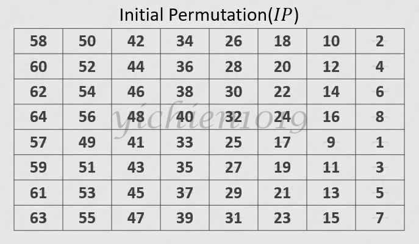
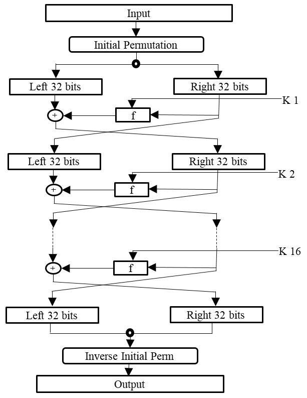
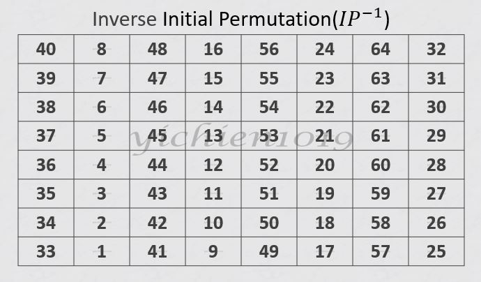

## 📖 RSA加密演算法
* 數據加密標準（英語：Data Encryption Standard，縮寫為DES）是一種對稱密鑰加密塊密碼算法
### 🔖 特性 : 
1. 鑰匙長度：56 bits 
<tab>(可以推導出16把48位元的子密鑰進行16回合重複的運算)
2. 區塊長度：64 bits 
<tab>(在 DES 演算法中，明文與密文區塊的長度都是 64 bits)
3. 重複次數：每個區塊重複經過加密器計算 16 次，每次計算時使用一把獨立的子鑰匙
4. 子鑰匙產生器：主鑰匙經過產生器處理之後，產生 16 把子鑰匙，每一把子鑰匙的長度為 48 bits
5. 演算法相容：基本上，加密與解密演算法是相同的，解密時將子鑰匙輸入順序與加密相反即可

### 🔖 加密過程
* 一個64位元的資料用DES加密
1. 先初始排列 IP(Initial Permutation)，這是一個將資料打亂的過程

> 由左往右、由上往下讀依序得到58、50、42、...、2、60、...
意思是輸入的第58位是輸出的第1位、輸入的第50位是輸出的第2位...
依序排列直到最後：輸入的第7位是輸出的第64位
2. 將輸入的64位元分成左右兩邊，右半邊先原封不動的成為輸出的左半邊，
右半邊再經過一個函數運算後和左半邊進行XOR成為輸出的右半邊(重複16遍)
> 資料被分成左右兩邊，右半經過函數運算、和左邊XOR後成為下一輪的左半，右半再原封不動成為下一輪的左半

* 中間的函數稱為F-function 

    1. 擴張(Expansion) : 右半邊輸入的32位元會經過擴張的過程變成48位元
    2. 跟子密鑰(k)做XOR : 擴張完後的48位元和48位元的子密鑰進行XOR
    3. S-Box 代換 : XOR完之後，48位元的資料分成6位元一組，總共有8組 
        (每一組都經過指定的S-Box做代換，6位元經過代換後成為4位元)
    4. 排列(Permutation) : 最後用一樣的方式查表得到最終輸出值

3. 最終排列 FP(Final Permutation)的打亂過程，他是初始排列的逆運算，意思是說將如果中間沒有經過第二關的話，原始資料就會原封不動的跑出來

> 最終排列其實就是初始排列的逆運算

#### 👉分析
* [《區塊密碼1》DES(1)- 加密過程](https://ithelp.ithome.com.tw/articles/10266443?sc=iThelpR)

