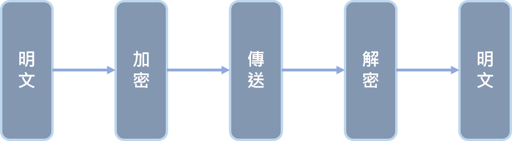

# 📝 期中作業
## 📖 簡介
>作者 : 劉怡謙 
>學號 : 110810519 
>班級 : 資工三
>主題 : 密碼學算法  
>原因 :   
>授權申明 : 
>>* [My_LICENSE](LICENSE.md)

## 📖 基本概念
防止在傳遞過程中被第三方拿到資訊而發明出來的技術，常使用於網路安全，存取控制與資訊機密性等。已被用於日常生活 : 使用者存取密碼、晶片卡、電子商務等。
#### 👉 密碼學包含：
* 機密性(Confidentiality)：確保訊息只有被授權者才能取得
* 完整性(Integrity)：偵測訊息是否遭受竄改
* 身分認證(Authentication)：傳送方與接受方需驗證識別
* 不可否認性(Non-Reputation)：提供訊息傳送方與接受方的交易證明
### 🔖 加密與解密過程

* 明文經過加密流程後變成密文，將密文傳送給對方，對方再透過解密流程解出密文
* 破譯 : 不透過解密手段得到明文稱為破譯，例如 : 暴力破解、攻擊漏洞等。

### 🔖 《對稱式加密》與《非對稱式加密》
#### 👉 對稱式加密

#### 👉 非對稱式加密

#### 👉 數位簽章

對稱加密 & 非對稱加密
對稱金鑰加密
公開金鑰加密
數位簽章
👉 