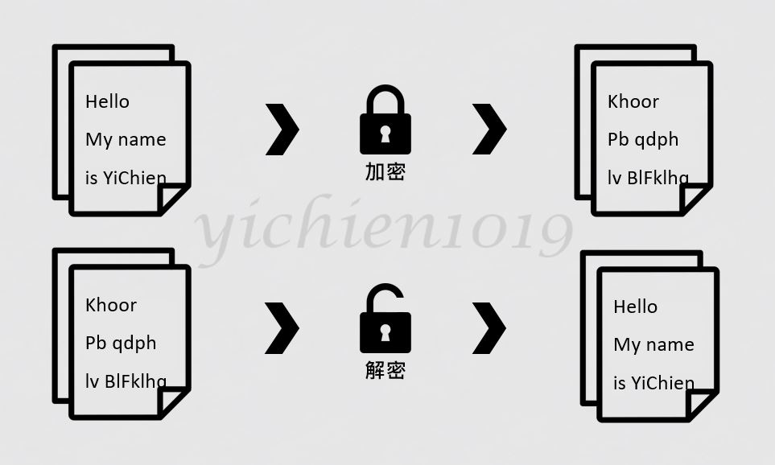
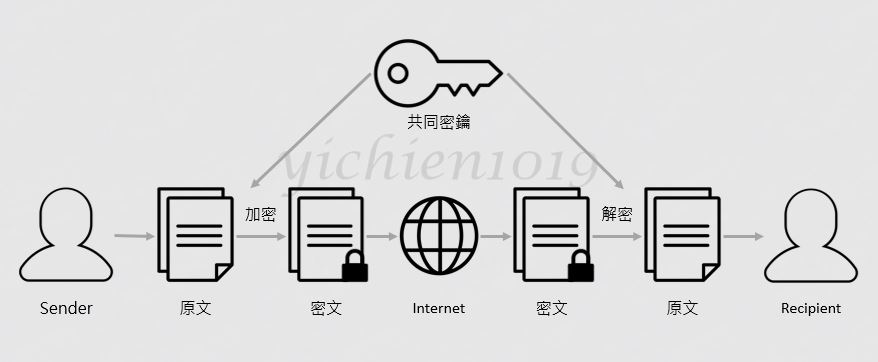
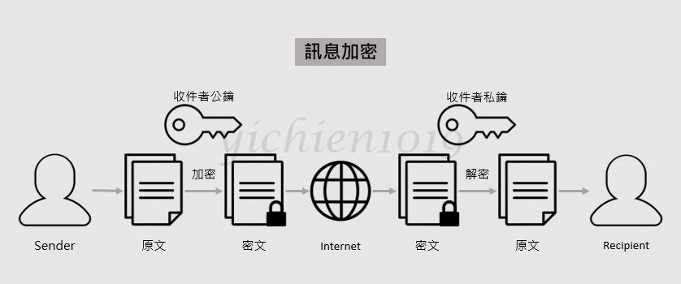
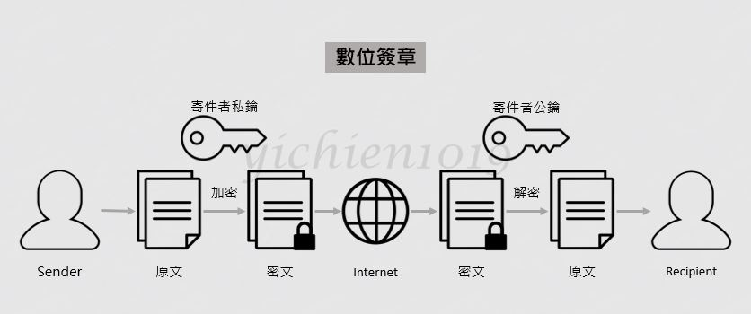
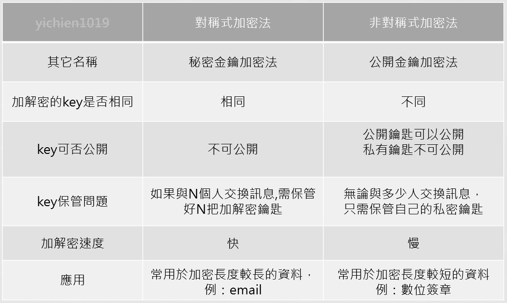

# 📝 期中作業
## 📖 簡介
>作者 : 劉怡謙 
>學號 : 110810519 
>班級 : 資工三 
>主題 : 密碼學算法  
>作品 : 本專案並非100%原創，有參考自[陳鍾誠的《軟體工程與演算法》課程 -- 110 上學期](https://gitlab.com/ccc110/sa/-/tree/master/alg/14-cryptography)資料輔助理解，但是因為我還沒辦法完全理解，故只有部分註解，其餘部分我會在理解後補上 
(文中含有`yichien1019`的文字或浮水印的圖片出自我自己所繪製) 
>授權申明 : 
>>* [My_LICENSE](LICENSE.md)

## 📖 基本概念
防止在傳遞過程中被第三方拿到資訊而發明出來的技術，常使用於網路安全，存取控制與資訊機密性等。已被用於日常生活 : 使用者存取密碼、晶片卡、電子商務等。
#### 👉 密碼學基本名詞：
> 密碼系統是由明文、加密演算法、金鑰、解
密演算法及密文組合而成
* 明文 (Plaintext) – 加密前的原始資料，為加密演算法的輸入，解密演算法的輸出。
* 密文 (Ciphertext) – 加密之後的資料，為加密演算法的輸出，解密演算法的輸入。
* 加密演演算法 (Encryption Algorithm) – 利用密鑰對明文進行加密的編碼動作的演算法。
* 解密演算法 (Decryption Algorithm) – 利用金鑰對密文進行解密的解碼動作的演算法。
* 解密 (Decipher) – 將密文還原為明文的過程。
* 密碼破解 (Cryptanalysis) – 不需經由加密金鑰或使用偽造金鑰即能夠將密文解原還為明文稱之。
#### 👉 密碼學包含：
* 機密性(Confidentiality)：確保訊息只有被授權者才能取得
    * 對稱、非對稱加密
* 完整性(Integrity)：偵測訊息是否遭受竄改
    * 單向雜湊、訊息認證碼、數字簽名
* 身分認證(Authentication)：傳送方與接受方需驗證識別
    * 訊息認證、數字簽名
* 不可否認性(Non-Reputation)：提供訊息傳送方與接受方的交易證明
    * 數字簽名
### 🔖 加密與解密過程

* 明文經過加密流程後變成密文，將密文傳送給對方，對方再透過解密流程解出密文
* 加密的資料即使在過程中被竊取，除非知道解密方法，否則無法得知內容，因此金鑰的妥善保存很重要
* 破譯 : 不透過解密手段得到明文稱為破譯，例如 : 暴力破解、攻擊漏洞等。

### 🔖 《對稱式加密》與《非對稱式加密》
* 區別在於對稱加密算法使用單個密鑰，而非對稱加密使用兩個不同但相關聯的密鑰。
#### 👉 對稱式加密 (秘密金鑰加密法)

* 對稱加密是指使用相同的密鑰進行加密和解密的一種密碼學方案
* 密鑰是隨機選擇的，其長度通常設置為128或256位，具體長度取決於所需的安全級別
* 這種信息加密的方式被廣泛應用於政府和軍隊中的機密通信，如今也廣泛應用於各種類型的計算機系統中，起到了增強數據安全性的作用。
* 常見的系統 : DES、FEAL、IDEA、SKIP...
> 
##### 📍 優點
* 較快速
* 如果使用足夠大的金鑰，將難以破解
* 比非對稱系統消耗更少的計算資源
##### 📍 缺點
* 需要有一個安全性機制將金鑰安全性的分送至交易的雙方。
* 當這些密鑰在不安全的網絡連接中共享時，它們很容易被惡意的第三方攔截

#### 👉 非對稱式加密 (公開金鑰加密法)

* 用於加密的密鑰稱為公鑰，可以與他人進行共享；用於解密的密鑰是私鑰，必需加以保存
> [RSA](RSA.md)
##### 📍 優點
* 公開鑰匙可以公開分送
* 即使有人攔截了他們訊息獲得了公鑰，他們也無法解密該消息
* 提供私密性、驗證與不可否認性等服務
##### 📍 缺點
* 效率較差

#### 👉 數位簽章

* 每個人都有一對「鑰匙」（數位身份），其中一個只有她/他本人知道（私鑰），另一個公開的（公鑰）。簽名的時候用私鑰，驗證簽名的時候用公鑰

#### 👉 對稱式 && 非對稱式 && 數位簽章

## 📖 參考資料
* [密碼學-維基百科](https://zh.wikipedia.org/wiki/%E5%AF%86%E7%A0%81%E5%AD%A6)
* [非對稱式加密演算法-RSA (觀念篇)](https://ithelp.ithome.com.tw/articles/10250721)
* 
* 

🖊️ editor : yi-chien Liu