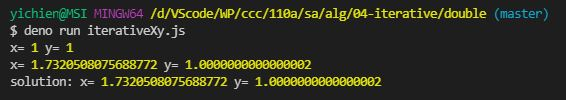
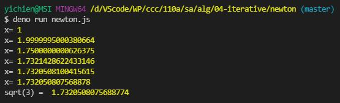
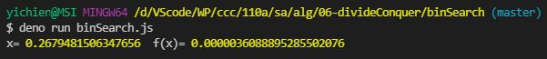
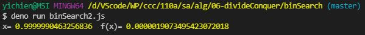
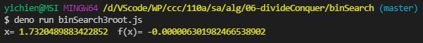
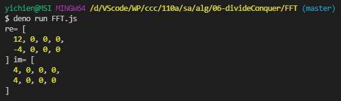
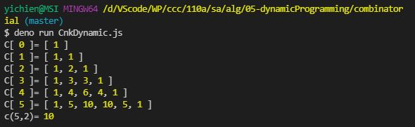
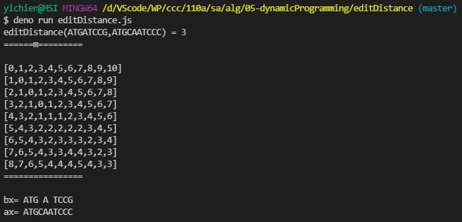
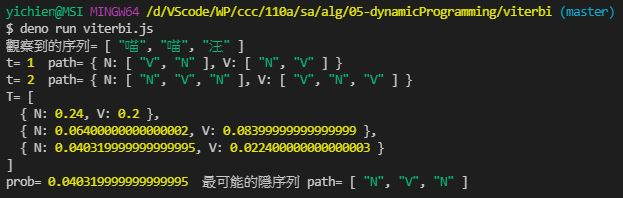

# 📝軟體工程與演算法第十三週筆記20211208
## 📖 迭代法
* 透過反覆計算 x[k+1] = f(x[k]) 的方式，當找到符合 x[k+1] =f(x[k]) 的 x 時，那麼我們就知道該 x 值會是 x=f(x) 的解答
#### 📍 計算過程
```
x2 =f(x1)
x3 =f(x2)
... 
x[k+1] =f(x[k])
```
#### 📍 範例
1. $`x = 3/x`$
2. $`x_{k+1} = x_k - \frac{1}{4} (x^2_k -3)`$
3. $`x_{k+1} = \frac{1}{2} (x_k + \frac{3}{x_k})`$
```javascript
var f1 = (x) => 3 / x
var f2 = (x) => x - 1 / 4 * (x * x - 3)
var f3 = (x) => 1 / 2 * (x + 3 / x)

var x1, x2, x3
x1 = x2 = x3 = 1
for (var i = 0; i < 20; i++) {
  x1 = f1(x1);  x2 = f2(x2); x3 = f3(x3)
  console.log('x1:', x1, 'x2', x2, 'x3', x3)
}
```
### 🔖 雙重迭代
1. $x = f(x)$
2. $y = f(x)$   /   $x = g(x)$
3. $x = g(f(x))$
## 📖 
### 🔖 
#### 📍 
## 💻 程式實際操作
### 🔗 alg/04-iterative/double/diterative1.js 
<details>
  <summary><b>Show code</b></summary>

  ```
/* x^2 - 2x + 1 = 0 改寫

y = x^2
2x-1 = y    => x=(y+1)/2
*/

function f(x) {
  return x*x
}

function g(y) {
  return (y+1)/2
}

function iterate(g, x) {
  console.log("x=", x);
  for (var i=0; i<100000; i++) {
    if (Math.abs(x-g(x)) < 0.001)
      return x
    x = g(f(x))
    console.log("x=", x);
  }
  return x
}

// var x = iterate(g, 10) // 會發散
var x = iterate(g, 0.5) // 會收斂
console.log("x=", x, "g(f(x))=", g(f(x)))

/* 永遠收斂的案例
x = 0.8*sqrt(x^2) = 0.8x .....

function f(x) {
  return x*x
}

function g(y) {
  return 0.8*Math.sqrt(y)
}
*/
  ```
</details>

#### The result of execution
```
yichien@MSI MINGW64 /d/VScode/WP/ccc/110a/sa/alg/04-iterative/double (master)
$ deno run diterative1.js 
x= 0.5
x= 0.625
x= 0.6953125
...
x= 0.9980013509364025
x= 0.9980013509364025 g(f(x))= 0.9980033482354422
```

### 🔗 alg/04-iterative/double/iterativeXy.js

<details>
  <summary><b>Show code</b></summary>

  ```
// 這個迭代一次就找到答案了。

// 求解 x^2 + y^2 = 4
// 一開始設定 x=1, y=1
let dmin = 0.000001

function getx(y) {
  return Math.sqrt(4-y*y)
}

function gety(x) {
  return Math.sqrt(4-x*x)
}

function iterate(x=1, y=1) {
  var xLast = x, yLast = y
  while (1) {
    console.log("x=", x, 'y=', y)
    x = getx(y)
    y = gety(x)
    if (Math.abs(xLast-x) < dmin) break
    xLast = x
    yLast = y
  }
  return {x, y}
}

var {x,y} = iterate()
console.log("solution: x=", x, 'y=', y)
  ```
</details>

#### The result of execution
```
yichien@MSI MINGW64 /d/VScode/WP/ccc/110a/sa/alg/04-iterative/double (master)
$ deno run iterativeXy.js 
x= 1 y= 1
x= 1.7320508075688772 y= 1.0000000000000002
solution: x= 1.7320508075688772 y= 1.0000000000000002
```

### 🔗 alg/04-iterative/newton/newton.js

<details>
  <summary><b>Show code</b></summary>

  ```
/*
牛頓逼近法求叠代式及應用 -- https://www.itread01.com/articles/1490047226.html

切線方程式 y  = f(x0) + f'(x0)(x-x0)

y = 0 時 0 = f(x0) + f'(x0)(x-x0)

=> -f(x0) = f'(x0)(x-x0)

=> -f(x0)/f'(x0) = x-x0

=> x0-f(x0)/f'(x0) = x

*/

let dx = 0.000001
let dmin = 0.000000001

function f(x) {
  return x*x - 3
  // return x*x*x - 8
}

function df(f, x) {
  return (f(x+dx)-f(x))/dx
}

function nextx(f, x) {
  return x-f(x)/df(f, x)
}

function iterate(x) {
  var xLast = x
  while (1) {
    console.log("x=", x)
    x = nextx(f, x)
    if (Math.abs(xLast-x) < dmin) break
    xLast = x
  }
  return x
}

console.log('sqrt(3) = ', iterate(1))
  ```
</details>

#### The result of execution
```
yichien@MSI MINGW64 /d/VScode/WP/ccc/110a/sa/alg/04-iterative/newton (master)
$ deno run newton.js 
x= 1
x= 1.9999995000380664        
x= 1.7500000000626375        
x= 1.7321428622433146        
x= 1.7320508100415615        
x= 1.732050807568878
sqrt(3) =  1.7320508075688774
```

### 🔗 alg/06-divideConquer/binSearch/binSearch.js 

<details>
  <summary><b>Show code</b></summary>

  ```
function f(x) {
  return x*x-4*x+1;
}

function bsolve(f,a,b) {
  var c = (a+b)/2;
  if (Math.abs(a-b) < 0.00001)
    return c;
  if (f(c)*f(a)>=0) // f(a), f(c) 同號，代表 f(c) 和 f(b) 異號
    return bsolve(f, c, b);
  else
    return bsolve(f, a, c);
}

var x=bsolve(f, 0, 1);
console.log("x=", x, " f(x)=", f(x));
  ```
</details>

#### The result of execution
```
yichien@MSI MINGW64 /d/VScode/WP/ccc/110a/sa/alg/06-divideConquer/binSearch (master)
$ deno run binSearch.js 
x= 0.2679481506347656  f(x)= 0.0000036088895285502076
```

### 🔗 alg/06-divideConquer/binSearch/binSearch2.js

<details>
  <summary><b>Show code</b></summary>

  ```
function f(x) {
  // return x*x-4*x+1;
  return (x-1)*(x-3);
}

function bsolve(f,a,b) {
  var c = (a+b)/2;
  if (Math.abs(a-b) < 0.00001)
    return c;
  if (f(c)*f(a)>=0)
    return bsolve(f, c, b);
  else
    return bsolve(f, a, c);
}

// var x=bsolve(f, 0, 1);
var x=bsolve(f, 0, 2.5);
console.log("x=", x, " f(x)=", f(x));
  ```
</details>

#### The result of execution
```
yichien@MSI MINGW64 /d/VScode/WP/ccc/110a/sa/alg/06-divideConquer/binSearch (master)
$ deno run binSearch2.js
x= 0.9999990463256836  f(x)= 0.0000019073495423072018
```

### 🔗 alg/06-divideConquer/binSearch/binSearch3root.js

<details>
  <summary><b>Show code</b></summary>

  ```
function f(x) {
  // return x*x-4*x+1;
  return x*x-3;
}

function bsolve(f,a,b) {
  var c = (a+b)/2;
  if (Math.abs(a-b) < 0.00001)
    return c;
  if (f(c)*f(a)>=0)
    return bsolve(f, c, b);
  else
    return bsolve(f, a, c);
}

// var x=bsolve(f, 0, 1);
var x=bsolve(f, 0, 3);
console.log("x=", x, " f(x)=", f(x));
  ```
</details>

#### The result of execution
```
yichien@MSI MINGW64 /d/VScode/WP/ccc/110a/sa/alg/06-divideConquer/binSearch (master)
$ deno run binSearch3root.js
x= 1.7320489883422852  f(x)= -0.000006301982466538902
```

### 🔗 alg/06-divideConquer/FFT/FFT.js 

<details>
  <summary><b>Show code</b></summary>

  ```
function FFT(x_re, x_im) {
  var m = x_re.length / 2, k, X_re = [], X_im = [], Y_re = [], Y_im = [],
      a, b, tw_re, tw_im;

  for (k = 0; k < m; ++k) {
    X_re[k] = x_re[2 * k];
    X_im[k] = x_im[2 * k];
    Y_re[k] = x_re[2 * k + 1];
    Y_im[k] = x_im[2 * k + 1];
  }

  if (m > 1) {
    FFT(X_re, X_im);
    FFT(Y_re, Y_im);
  }

  for (k = 0; k < m; ++k) {
    a = -Math.PI * k / m, tw_re = Math.cos(a), tw_im = Math.sin(a);
    a = tw_re * Y_re[k] - tw_im * Y_im[k];
    b = tw_re * Y_im[k] + tw_im * Y_re[k];
    x_re[k] = X_re[k] + a;
    x_im[k] = X_im[k] + b;
    x_re[k + m] = X_re[k] - a;
    x_im[k + m] = X_im[k] - b;
  }
}

let re = [1,2,1,2,1,2,1,2]
let im = [1,0,1,0,1,0,1,0]
FFT(re, im)
console.log('re=', re, 'im=', im)
  ```
</details>

#### The result of execution
```
yichien@MSI MINGW64 /d/VScode/WP/ccc/110a/sa/alg/06-divideConquer/FFT (master)
$ deno run FFT.js 
re= [
  12, 0, 0, 0,
  -4, 0, 0, 0 
] im= [       
  4, 0, 0, 0, 
  4, 0, 0, 0  
]
```

### 🔗 alg/05-dynamicProgramming/combinatorial/CnkDynamic.js 

<details>
  <summary><b>Show code</b></summary>

  ```
function c(N, K) {
  var C = [];
  for (let n=0; n<=N; n++) {
    C[n] = []
    C[n][0] = 1
    C[n][n] = 1
  }
  for (let n=1; n<=N; n++) {
    for (let k=1; k<n; k++) {
      C[n][k] = C[n-1][k-1] + C[n-1][k]
    }
  }
  for(let n=0; n<=N; n++) {
    console.log("C[", n, "]=", C[n])
  }
  return C[N][K];
}

console.log("c(5,2)=", c(5,2))
  ```
</details>

#### The result of execution
* C(n,k) -- 用動態規劃法求解
```
yichien@MSI MINGW64 /d/VScode/WP/ccc/110a/sa/alg/05-dynamicProgramming/combinatorial (master)
$ deno run CnkDynamic.js 
C[ 0 ]= [ 1 ]
C[ 1 ]= [ 1, 1 ]
C[ 2 ]= [ 1, 2, 1 ]
C[ 3 ]= [ 1, 3, 3, 1 ]        
C[ 4 ]= [ 1, 4, 6, 4, 1 ]     
C[ 5 ]= [ 1, 5, 10, 10, 5, 1 ]
c(5,2)= 10
```

### 🔗 alg/05-dynamicProgramming/editDistance/editDistance.js 

<details>
  <summary><b>Show code</b></summary>

  ```
function editDistance (b, a) {
  if (a.length === 0) return b.length
  if (b.length === 0) return a.length

  var m = []
  for (let i = 0; i <= b.length; i++) m[i] = [i]
  for (let j = 0; j <= a.length; j++) m[0][j] = j

  for (let i = 1; i <= b.length; i++) {
    for (let j = 1; j <= a.length; j++) {
      if (b.charAt(i - 1) === a.charAt(j - 1)) {
        m[i][j] = m[i - 1][j - 1]
      } else {
        m[i][j] = Math.min(
          m[i - 1][j - 1] + 1, // 取代
          Math.min(
            m[i][j - 1] + 1, // 插入
            m[i - 1][j] + 1
          )
        ) // 刪除
      }
    }
  }

  return { d: m[b.length][a.length], m: m }
}

function align (b, a, m) {
  let i = b.length, j = a.length
  let bx = '', ax = ''
  while (i > 0 && j > 0) {
    if (m[i][j] === m[i - 1][j] + 1) {
      // 插入 b[i]
      i--
      ax = ' ' + ax
      bx = b[i] + bx
    } else if (m[i][j] === m[i][j - 1] + 1) {
      // 插入 a[j]
      j--
      ax = a[j] + ax
      bx = ' ' + bx
    } else if (
      m[i][j] === m[i - 1][j - 1] + 1 || // 取代
      m[i][j] === m[i - 1][j - 1]
    ) {
      // 相同
      i--
      j--
      bx = b[i] + bx
      ax = a[j] + ax
    }
  }
  while (i > 0) {
    i--
    bx = b[i] + bx
    ax = ' ' + ax
  }
  while (j > 0) {
    j--
    ax = a[j] + ax
    bx = ' ' + bx
  }
  console.log('bx=', bx)
  console.log('ax=', ax)
}

function dump (m) {
  for (let row of m) {
    console.log(JSON.stringify(row))
  }
}

var a, b
/*
a = "010100001"
b = "010100010"
console.log("dist(%s,%s) = %s", a, b, editDistance(a,b))
*/
//b = "ATG  ATCCG"
a = 'ATGCAATCCC'
b = 'ATGATCCG'
//b = "  TCCGAA"
// a   = "ATCCCAAA"
// b   = "TCCGAA"
let e = editDistance(b, a)
console.log('editDistance(%s,%s) = %s', b, a, e.d)
console.log('======m=========\n')
dump(e.m)
console.log('================\n')
align(b, a, e.m)
  ```
</details>

#### The result of execution
* 字串編輯距離，為了對齊而產生的空格
```
yichien@MSI MINGW64 /d/VScode/WP/ccc/110a/sa/alg/05-dynamicProgramming/editDistance (master)
$ deno run editDistance.js 
editDistance(ATGATCCG,ATGCAATCCC) = 3
======m=========        

[0,1,2,3,4,5,6,7,8,9,10]
[1,0,1,2,3,4,5,6,7,8,9] 
[2,1,0,1,2,3,4,5,6,7,8] 
[3,2,1,0,1,2,3,4,5,6,7] 
[4,3,2,1,1,1,2,3,4,5,6] 
[5,4,3,2,2,2,2,2,3,4,5] 
[6,5,4,3,2,3,3,3,2,3,4] 
[7,6,5,4,3,3,4,4,3,2,3] 
[8,7,6,5,4,4,4,5,4,3,3] 
================        

bx= ATG A TCCG
ax= ATGCAATCCC
```

### 🔗 alg/05-dynamicProgramming/viterbi/viterbi.js

<details>
  <summary><b>Show code</b></summary>

  ```
const P = {
  'N': 0.6,
  'V': 0.4,
  'N=>N': 0.3,
  'N=>V': 0.7,
  'V=>N': 0.8,
  'V=>V': 0.2,
  'N=>喵': 0.4,
  'N=>汪': 0.6,
  'V=>喵': 0.5,
  'V=>汪': 0.5,
}

function argmax(list) {
  let max = Number.NEGATIVE_INFINITY, index = null
  for (let k in list) {
    if (list[k] > max) { index=k; max=list[k] }
  }
  return {max, index}
}

function viterbi(obs, states, P) {
  console.log('觀察到的序列=', obs)
  const T = [{}] // Viterbi Table
  let path = {}  // path[state] = 從 0 到 t 到達 state 機率最大的 path
  for (let y of states) { // # Initialize base cases (t == 0)
    T[0][y] = P[y] * P[y+'=>'+obs[0]]
    path[y] = [y]
  }
  for (let t=1; t<obs.length; t++) { // # Run Viterbi for t > 0
    T[t] = {}
    let newpath = {}
    for (let y of states) {
      let {max:prob, index:si} = argmax(states.map((y0)=>T[t-1][y0] * P[y0+'=>'+y] * P[y+'=>'+obs[t]]))
      let state = states[si]
      // console.log('y=%s prob=%d state=%s', y, prob, state)
      T[t][y] = prob
      newpath[y] = path[state].concat(y)
    }
    // console.log('t=%d T=%j', t, T)
    path = newpath
    console.log('t=', t, ' path=', path)
  }
  let {max:prob, index:si} = argmax(states.map((y)=>T[obs.length - 1][y]))
  console.log('T=', T)
  return {prob, path:path[states[si]]}
}

let {prob, path} = viterbi('喵 喵 汪'.split(' '), ['N', 'V'], P)
console.log('prob=', prob, ' 最可能的隱序列 path=', path)
  ```
</details>

#### The result of execution
* 隱馬可夫模型 : 尋找產生某『表現序列』最可能的『隱狀態序列』
```
yichien@MSI MINGW64 /d/VScode/WP/ccc/110a/sa/alg/05-dynamicProgramming/viterbi (master)
$ deno run viterbi.js 
觀察到的序列= [ "喵", "喵", "汪" ]
t= 1  path= { N: [ "V", "N" ], V: [ "N", "V" ] }
t= 2  path= { N: [ "N", "V", "N" ], V: [ "V", "N", "V" ] }        
T= [
  { N: 0.24, V: 0.2 },
  { N: 0.06400000000000002, V: 0.08399999999999999 },
  { N: 0.040319999999999995, V: 0.022400000000000003 }
]
prob= 0.040319999999999995  最可能的隱序列 path= [ "N", "V", "N" ]
```

### 🔗 

<details>
  <summary><b>Show code</b></summary>

  ```
  ```
</details>

#### The result of execution
```
```

## 📖 補充資料
* [陳鍾誠的《軟體工程與演算法》課程 - 迭代法 Iterative](https://gitlab.com/ccc110/sa/-/blob/master/alg/_doc/04-iterative.md)
* [字串編輯距離](https://zh.wikipedia.org/wiki/%E7%B7%A8%E8%BC%AF%E8%B7%9D%E9%9B%A2)