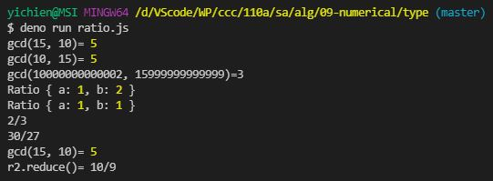
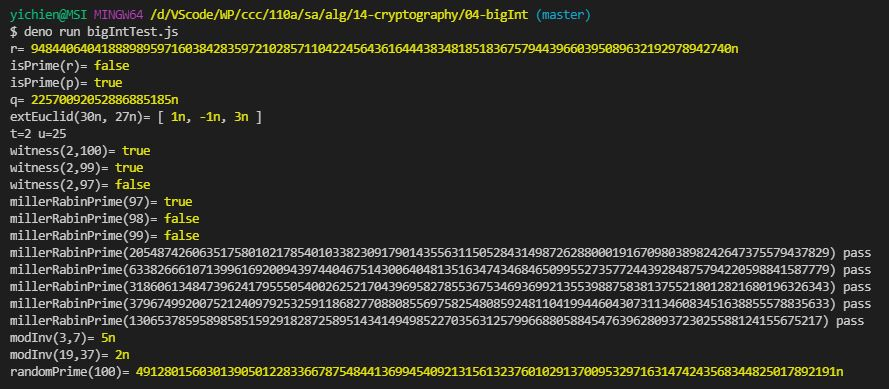

# 📝軟體工程與演算法第十四週筆記20211215
## 📖 RSA加密演算法
* 一種非對稱加密演算法，在公開金鑰加密和電子商業中被廣泛使用
* 極大整數做因數分解愈困難，RSA 演算法愈可靠
* 只要其鑰匙的長度足夠長，用RSA加密的訊息實際上是不能被破解的
### 🔖 公鑰與私鑰的產生
假設 A 想要通過一個不可靠的媒體接收 B 的一條私人訊息。她可以用以下的方式來產生一個公鑰和一個私鑰：
1. 隨意選擇兩個大的質數 $p$ 和 $q$ ， $p$ 不等於 $q$ ，計算$N=pq$。
2. 根據歐拉函數，求得
<br>
3. 選擇一個小於 $r$ 的整數 $e$ 與 $r$ 互質。並求得{\displaystyle e}e關於{\displaystyle r}r的模反元素，命名為{\displaystyle d}d（求{\displaystyle d}d令{\displaystyle ed\equiv 1{\pmod {r}}}{\displaystyle ed\equiv 1{\pmod {r}}}）。（模反元素存在，若且唯若{\displaystyle e}e與{\displaystyle r}r互質）
4. 將{\displaystyle p}p和{\displaystyle q}q的記錄銷毀。
{\displaystyle (N,e)}(N,e)是公鑰，{\displaystyle (N,d)}(N,d)是私鑰。愛麗絲將她的公鑰{\displaystyle (N,e)}(N,e)傳給鮑伯，而將她的私鑰{\displaystyle (N,d)}(N,d)藏起來
#### 📍 
## 💻 程式實際操作
### 🔗 alg/09-numerical/type/ratio

<details>
  <summary><b>Show code</b></summary>

  ```
class Ratio {
  constructor(a,b) { this.a = a; this.b = b; }
  
  mul(r2) { return new Ratio(this.a*r2.a, this.b*r2.b); }
  
  div(r2) { return new Ratio(this.a*r2.b, this.b*r2.a); }
  
  inv() { return new Ratio(this.b, this.a); }
  
  add(r2) { return new Ratio(this.a*r2.b+this.b*r2.a, this.b*r2.b); }
  
  sub(r2) { return new Ratio(this.a*r2.b-this.b*r2.a, this.b*r2.b); }
  
  toString() { return this.a+'/'+this.b; }

  parse(s) {
    var m = s.match(/^(\d+)(\/(\d+))?$/);
    var a = parseInt(m[1]);
    var b = typeof m[3]==='undefined'?1:parseInt(m[3]);
    return new Ratio(a, b)
  } 
}

Ratio.parse = Ratio.prototype.parse;

var r0 = Ratio.parse('1/2');
console.log(r0);

r0 = Ratio.parse('1');
console.log(r0);

var r1 = new Ratio(2,3);
console.log(r1.toString());

var r2 = r1.mul(r1).add(r1);
console.log(r2.toString());
  ```
</details>

#### The result of execution
* 有理數(rational number)是可以寫成  $p/q$ 這樣分數的數值 
* 加、減、乘、除四則運算是封閉的，亦即有理數加、減、乘、除有理數的結果仍為有理數
> $(a/b)+(c/d)=(a×d+b×c)/(b×d)$<br>
> $(a/b)-(c/d)=(a×d-b×c)/(b×d)$<br>
> $(a/b)×(c/d)=(a×c)/(b×d)$<br>
> $(a/b)÷(c/d)=(a×d)/(b×c)$<br>
```
yichien@MSI MINGW64 /d/VScode/WP/ccc/110a/sa/alg/09-numerical/type (master)
$ deno run ratio.js
gcd(15, 10)= 5
gcd(10, 15)= 5
gcd(10000000000002, 15999999999999)=3
Ratio { a: 1, b: 2 }
Ratio { a: 1, b: 1 }
2/3
30/27
gcd(15, 10)= 5
r2.reduce()= 10/9
```

### 🔗 alg/14-cryptography/04-bigInt/bigIntTest.js

<details>
  <summary><b>Show code in bigint</b></summary>

  ```
function randomInt(a: number, b: number) {
  return a + Math.floor(Math.random() * (b - a))
}

export function randomBigInt(len: number) {
  let list = []
  for (let i = 0; i < len; i++) {
    list.push('' + randomInt(0, 10))
  }
  return BigInt(list.join(''))
}

export function modPow(b: bigint, e: bigint, n: bigint): bigint {
  b = b % n
  let r = 1n
  while (e > 0) {
    if ((e % 2n) === 1n) {
      r = r * b % n
    }
    e = e / 2n
    b = b ** 2n % n
  }
  return r
}

// gcd(a,b) = ri = si+b*ti
export function extEuclid(a: bigint, b: bigint) {
  let [si, s] = [1n, 0n] // let si = 1n, s = 0n // let [si,s] = [1n,0n]
  let [ti, t] = [0n, 1n] // let ti = 0n, t = 1n // let [ti,t] = [0n,1n]
  let [ri, r] = [a, b] // let ri = a, r = b   // let [ri,r] = [a,b]
  if (b === 0n)
    return [1n, 0n, a]
  else {
    while (r != 0n) {
      let q = ri / r
      let rt = r; r = ri - q * rt; ri = rt; // [ri, r] = [r, ri-q*r]
      let st = s; s = si - q * st; si = st; // [si, s] = [s, si-q*s]
      let tt = t; t = ti - q * tt; ti = tt; // [ti, t] = [t, ti-q*t]
    }
  }
  return [si, ti, ri]
}

// https://ithelp.ithome.com.tw/articles/10236425
// 擴展歐幾里得算法的等效公式：ax+by = gcd(a,b)。
// gcd(a,b)=ri=1=a*si+b*ti
// gcd(x,N)=1=x*si+N*ti   => x*si=1 mod N
export function modInv(x:bigint, N:bigint) {
  let [si] = extEuclid(x, N)
  return (si+N)%N
}

// ===================== millerRabinPrime() test======================
// Fermat 定理：若 n 是質數，則 a^{n-1} mod n = 1
// Pseudo Prime 偽質數：若 a^{n-1} mod n = 1
export function decompose(m: bigint) { // m=2^t * u
  let u = m
  for (var t = 0n; u % 2n == 0n; u = u / 2n) {
    t++
  }
  return { t, u }
}

export function witness(a: bigint, n: bigint) {
  let { t, u } = decompose(n - 1n)
  let x = modPow(a, u, n)
  for (let i = 1n; i <= t; i++) {
    let xn = modPow(x, 2n, n)
    if (xn == 1n && x != 1n && x != n - 1n)
      return true
    x = xn
  }
  if (x != 1n) return true
  return false
}

/* 這個太慢，所以用隨機的 millerRabinPrime() 檢驗
export function isPrime(p:bigint) {
  for (let i = 2n; i * i <= p; i++) {
    if (p % i === 0n) return false;
  }
  return true;
}
*/
export function millerRabinPrime(n: bigint, s: bigint) {
  let len = n.toString().length
  for (let i = 1n; i <= s; i++) {
    let a = randomBigInt(len) % n
    if (witness(a, n))
      return false
  }
  return true
}

export function isPrime(n: bigint) {
  return millerRabinPrime(n, 10n)
}

// 找不到就傳回 null
export function randomPrime(len: number, maxLoops: number = 9999999) {
  var r = null
  for (let i = 0; i < maxLoops; i++) {
    r = randomBigInt(len)
    if (isPrime(r)) break
  }
  return r
}
  ```
</details>

#### The result of execution
```
yichien@MSI MINGW64 /d/VScode/WP/ccc/110a/sa/alg/14-cryptography/04-bigInt (master)
$ deno run bigIntTest.js 
r= 9484406404188898959716038428359721028571104224564361644438348185183675794439660395089632192978942740n
isPrime(r)= false       
isPrime(p)= true        
q= 22570092052886885185n
extEuclid(30n, 27n)= [ 1n, -1n, 3n ]
t=2 u=25
witness(2,100)= true
witness(2,99)= true
witness(2,97)= false
millerRabinPrime(97)= true
millerRabinPrime(98)= false
millerRabinPrime(99)= false
millerRabinPrime(2054874260635175801021785401033823091790143556311505284314987262880001916709803898242647375579437829) pass
millerRabinPrime(6338266610713996169200943974404675143006404813516347434684650995527357724439284875794220598841587779) pass
millerRabinPrime(3186061348473962417955505400262521704396958278553675346936992135539887583813755218012821680196326343) pass
millerRabinPrime(3796749920075212409792532591186827708808556975825480859248110419944604307311346083451638855578835633) pass
millerRabinPrime(130653785958985851592918287258951434149498522703563125799668805884547639628093723025588124155675217) pass
modInv(3,7)= 5n
modInv(19,37)= 2n
randomPrime(100)= 4912801560301390501228336678754844136994540921315613237601029137009532971631474243568344825017892191n
```

### 🔗 

<details>
  <summary><b>Show code</b></summary>

  ```
  ```
</details>

#### The result of execution
```
```

### 🔗 

<details>
  <summary><b>Show code</b></summary>

  ```
  ```
</details>

#### The result of execution
```
```

### 🔗 

<details>
  <summary><b>Show code</b></summary>

  ```
  ```
</details>

#### The result of execution
```
```

### 🔗 

<details>
  <summary><b>Show code</b></summary>

  ```
  ```
</details>

#### The result of execution
```
```

### 🔗 

<details>
  <summary><b>Show code</b></summary>

  ```
  ```
</details>

#### The result of execution
```
```

### 🔗 

<details>
  <summary><b>Show code</b></summary>

  ```
  ```
</details>

#### The result of execution
```
```
## 📖 補充資料
* [RSA加密演算法 - 維基百科](https://zh.wikipedia.org/wiki/RSA%E5%8A%A0%E5%AF%86%E6%BC%94%E7%AE%97%E6%B3%95)

14.35