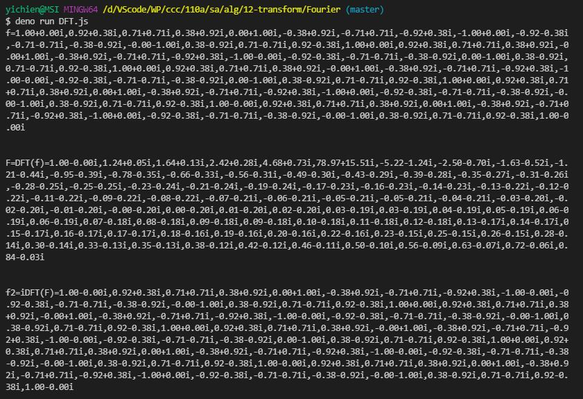
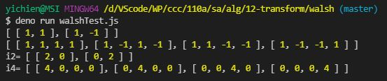

# 📝軟體工程與演算法第十六週筆記20211229
## 📖 傅立葉轉換
* 線性積分轉換，用於信號在時域（或空域）和頻域之間的轉換
### 🔖 傅立葉轉換家族中的關係
變換 | 時間 | 頻率
--- | --- | ---
連續傅立葉轉換|連續，非週期性|連續，非週期性
傅立葉級數|連續，週期性|離散，非週期性
離散時間傅立葉轉換|離散，非週期性|連續，週期性
離散傅立葉轉換|離散，週期性|離散，週期性

### 🔖 
#### 📍 
## 💻 程式實際操作
### 🔗 alg/12-transform/Fourier/DFT.js

<details>
  <summary><b>Show code</b></summary>

  ```
import { Complex } from './complex.js'

var DFT = function (f) {
  let N = f.length
  let F = []
  for (let n=0; n<N; n++) F[n] = Complex.parse('0+0i')
  for (let x=0; x<N; x++) {
    for (let n=0; n<N; n++) {
      let exp = Complex.expi((-2.0*Math.PI*x)/N*n)
      let fexp = f[x].mul(exp)
      F[n] = F[n].add(fexp)
    }
  }
  return F
}

var iDFT = function (F) {
  let N = F.length
  let f = []
  for (let x=0; x<N; x++) f[x] = Complex.parse('0+0i')
  for (let n=0; n<N; n++) {
    for (let x=0; x<N; x++) {
      let exp = Complex.expi((2.0*Math.PI*x)/N*n)
      let Fexp = F[n].mul(exp)
      Fexp.r /= N; Fexp.i /= N;
      f[x] = f[x].add(Fexp)
    }
  }
  return f
}

var steps = function(from, to, step = 1) {
	var a=[];
	for (var t=from; t<=to; t+=step)
		a.push(t);
	return a;
}

var x = steps(0, 10*Math.PI, Math.PI/8)
var f = x.map(Complex.expi)

console.log('f=%s\n\n', f)
var F = DFT(f)
console.log('F=DFT(f)=%s\n\n', F)
var f2 = iDFT(F)
console.log('f2=iDFT(F)=%s\n\n', f2)
  ```
</details>

#### The result of execution
```
yichien@MSI MINGW64 /d/VScode/WP/ccc/110a/sa/alg/12-transform/Fourier (master)
$ deno run DFT.js 
f=1.00+0.00i,0.92+0.38i,0.71+0.71i,0.38+0.92i,0.00+1.00i,-0.38+0.92i,-0.71+0.71i,-0.92+0.38i,-1.00+0.00i,-0.92-0.38i,-0.71-0.71i,-0.38-0.92i,-0.00-1.00i,0.38-0.92i,0.71-0.71i,0.92-0.38i,1.00+0.00i,0.92+0.38i,0.71+0.71i,0.38+0.92i,-0.00+1.00i,-0.38+0.92i,-0.71+0.71i,-0.92+0.38i,-1.00-0.00i,-0.92-0.38i,-0.71-0.71i,-0.38-0.92i,0.00-1.00i,0.38-0.92i,0.71-0.71i,0.92-0.38i,1.00+0.00i,0.92+0.38i,0.71+0.71i,0.38+0.92i,-0.00+1.00i,-0.38+0.92i,-0.71+0.71i,-0.92+0.38i,-1.00-0.00i,-0.92-0.38i,-0.71-0.71i,-0.38-0.92i,0.00-1.00i,0.38-0.92i,0.71-0.71i,0.92-0.38i,1.00+0.00i,0.92+0.38i,0.71+0.71i,0.38+0.92i,0.00+1.00i,-0.38+0.92i,-0.71+0.71i,-0.92+0.38i,-1.00+0.00i,-0.92-0.38i,-0.71-0.71i,-0.38-0.92i,-0.00-1.00i,0.38-0.92i,0.71-0.71i,0.92-0.38i,1.00-0.00i,0.92+0.38i,0.71+0.71i,0.38+0.92i,0.00+1.00i,-0.38+0.92i,-0.71+0.71i,-0.92+0.38i,-1.00+0.00i,-0.92-0.38i,-0.71-0.71i,-0.38-0.92i,-0.00-1.00i,0.38-0.92i,0.71-0.71i,0.92-0.38i,1.00-0.00i


F=DFT(f)=1.00-0.00i,1.24+0.05i,1.64+0.13i,2.42+0.28i,4.68+0.73i,78.97+15.51i,-5.22-1.24i,-2.50-0.70i,-1.63-0.52i,-1.21-0.44i,-0.95-0.39i,-0.78-0.35i,-0.66-0.33i,-0.56-0.31i,-0.49-0.30i,-0.43-0.29i,-0.39-0.28i,-0.35-0.27i,-0.31-0.26i,-0.28-0.25i,-0.25-0.25i,-0.23-0.24i,-0.21-0.24i,-0.19-0.24i,-0.17-0.23i,-0.16-0.23i,-0.14-0.23i,-0.13-0.22i,-0.12-0.22i,-0.11-0.22i,-0.09-0.22i,-0.08-0.22i,-0.07-0.21i,-0.06-0.21i,-0.05-0.21i,-0.05-0.21i,-0.04-0.21i,-0.03-0.20i,-0.02-0.20i,-0.01-0.20i,-0.00-0.20i,0.00-0.20i,0.01-0.20i,0.02-0.20i,0.03-0.19i,0.03-0.19i,0.04-0.19i,0.05-0.19i,0.06-0.19i,0.06-0.19i,0.07-0.18i,0.08-0.18i,0.09-0.18i,0.09-0.18i,0.10-0.18i,0.11-0.18i,0.12-0.18i,0.13-0.17i,0.14-0.17i,0.15-0.17i,0.16-0.17i,0.17-0.17i,0.18-0.16i,0.19-0.16i,0.20-0.16i,0.22-0.16i,0.23-0.15i,0.25-0.15i,0.26-0.15i,0.28-0.14i,0.30-0.14i,0.33-0.13i,0.35-0.13i,0.38-0.12i,0.42-0.12i,0.46-0.11i,0.50-0.10i,0.56-0.09i,0.63-0.07i,0.72-0.06i,0.84-0.03i


f2=iDFT(F)=1.00-0.00i,0.92+0.38i,0.71+0.71i,0.38+0.92i,0.00+1.00i,-0.38+0.92i,-0.71+0.71i,-0.92+0.38i,-1.00-0.00i,-0.92-0.38i,-0.71-0.71i,-0.38-0.92i,-0.00-1.00i,0.38-0.92i,0.71-0.71i,0.92-0.38i,1.00+0.00i,0.92+0.38i,0.71+0.71i,0.38+0.92i,-0.00+1.00i,-0.38+0.92i,-0.71+0.71i,-0.92+0.38i,-1.00-0.00i,-0.92-0.38i,-0.71-0.71i,-0.38-0.92i,-0.00-1.00i,0.38-0.92i,0.71-0.71i,0.92-0.38i,1.00+0.00i,0.92+0.38i,0.71+0.71i,0.38+0.92i,-0.00+1.00i,-0.38+0.92i,-0.71+0.71i,-0.92+0.38i,-1.00-0.00i,-0.92-0.38i,-0.71-0.71i,-0.38-0.92i,0.00-1.00i,0.38-0.92i,0.71-0.71i,0.92-0.38i,1.00+0.00i,0.92+0.38i,0.71+0.71i,0.38+0.92i,0.00+1.00i,-0.38+0.92i,-0.71+0.71i,-0.92+0.38i,-1.00-0.00i,-0.92-0.38i,-0.71-0.71i,-0.38-0.92i,-0.00-1.00i,0.38-0.92i,0.71-0.71i,0.92-0.38i,1.00-0.00i,0.92+0.38i,0.71+0.71i,0.38+0.92i,0.00+1.00i,-0.38+0.92i,-0.71+0.71i,-0.92+0.38i,-1.00+0.00i,-0.92-0.38i,-0.71-0.71i,-0.38-0.92i,-0.00-1.00i,0.38-0.92i,0.71-0.71i,0.92-0.38i,1.00-0.00i
```

### 🔗 alg/12-transform/walsh/walshTest.js 

<details>
  <summary><b>Show code</b></summary>

  ```
function wfill(w, w2, x, y, c=1) {
  let n2 = w2.length
  for (let i=0; i<n2; i++) {
    for (let j=0; j<n2; j++) {
      w[x+i][y+j] = w2[i][j]*c
    }
  }
  return w
}

export function walsh(n) {
  if (n === 1) return [[1]]
  let w2 = walsh(n/2)
  let w = new Array(n)
  for (let i=0; i<n; i++) w[i] = new Array(n)
  let n2 = n/2
  wfill(w, w2, 0, 0, 1)
  wfill(w, w2, 0, n2, 1)
  wfill(w, w2, n2, 0, 1)
  wfill(w, w2, n2, n2, -1)
  return w
}
  ```
</details>

#### The result of execution
```
yichien@MSI MINGW64 /d/VScode/WP/ccc/110a/sa/alg/12-transform/walsh (master)
$ deno run walshTest.js 
[ [ 1, 1 ], [ 1, -1 ] ]
[ [ 1, 1, 1, 1 ], [ 1, -1, 1, -1 ], [ 1, 1, -1, -1 ], [ 1, -1, -1, 1 ] ]
i2= [ [ 2, 0 ], [ 0, 2 ] ]
i4= [ [ 4, 0, 0, 0 ], [ 0, 4, 0, 0 ], [ 0, 0, 4, 0 ], [ 0, 0, 0, 4 ] ]
```

### 🔗 

<details>
  <summary><b>Show code</b></summary>

  ```
  ```
</details>

#### The result of execution
```
```
### 🔗 

<details>
  <summary><b>Show code</b></summary>

  ```
  ```
</details>

#### The result of execution
```
```
### 🔗 

<details>
  <summary><b>Show code</b></summary>

  ```
  ```
</details>

#### The result of execution
```
```
## 📖 補充資料

