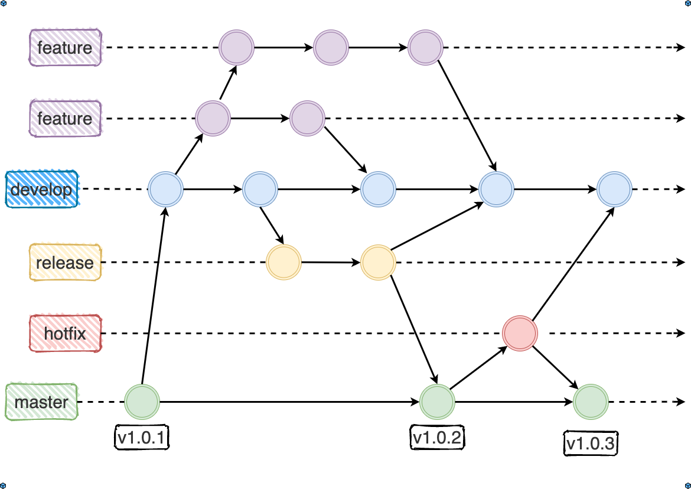

# 📝 軟體工程與演算法第三週筆記20210929
## 📖 正規軍 V.S. 特種部隊
### 🔖 正規軍 (瀑布模式)
* 傳統模式，像是一些大公司，EX : Microsoft、IBM、CMMI
* 需求明確、技術能力夠，可以採用此模式
### 🔖 特種部隊 (螺旋模式)
* 敏捷開發，EX : Scrum、XP
* 高效率的面對面溝通、品質焦點

## 📖 合作開發 (WORKFLOW)

> * master : 主分支
> * develop : 開發分支
> * feature : 功能分支
> * release : 欲發分支
> * hotfix : 補丁分支
### 🔖 GITHUB FLOW操作步驟
順序 | 主控者 | 貢獻者
---- | ----- | -----
1 | 創建專案 | 
2 | 創建分支 | 
3 |  | fork專案
4 |  | clone專案
5 |  | 修改程式
6 |  | 測試程式
7 |  | 創建分支
8 |  | 回推檔案
9 |  | 發pull resquest
10| 測試程式 | 
11| 收pull resquest | 
12| 合併分支到主要分支 | 

### 🔖 分支的創建與轉換
#### 📍 查看現有分支 `git branch`
```
yichien@MSI MINGW64 /d/VScode/WP/ccc/110a/sa110a (master)
$ git branch
  add_code
* master
```
#### 📍 創建新分支 `git branch + 分支名`
```
yichien@MSI MINGW64 /d/VScode/WP/ccc/110a/sa110a (master)
$ git branch add_code
```
#### 📍 刪除已存在分支 `git branch -d + 分支名`
```
yichien@MSI MINGW64 /d/VScode/WP/ccc/110a/sa110a ((6a4b936...))
$ git branch -d add
Deleted branch add (was 6a4b936).
```
#### 📍 創建新分支並切換 `git checkout -b + 分支名`
```
yichien@MSI MINGW64 /d/VScode/WP/ccc/110a/sa110a (master)
$ git checkout -b add_code
Switched to a new branch 'add_code'
```
#### 📍 切換分支 `git checkout + 分支名`
```
yichien@MSI MINGW64 /d/VScode/WP/ccc/110a/sa110a (add_code)
$ git checkout master
Switched to branch 'master' 
```

### 🔖 GITFLOW合作
#### 📍 設定原作的遠端節點 `git remote add + 原作者代稱 + <URL>`
* 先使用fork，再將對方設定成upstream才能更新
```
yichien@MSI MINGW64 /d/VScode/WP/ccc/110a/sa110a_lodash_teamwork (main)
$ git remote add chun https://github.com/Chen-Chun/sa110a_lodash_teamwork.git
```
#### 📍 查看已存在的節點 `git remote -v`
```
yichien@MSI MINGW64 /d/VScode/WP/ccc/110a/sa110a_lodash_teamwork (main)
$ git remote -v
chun    https://github.com/Chen-Chun/sa110a_lodash_teamwork.git (fetch)
chun    https://github.com/Chen-Chun/sa110a_lodash_teamwork.git (push) 
origin  git@github.com:yichien1019/sa110a_lodash_teamwork.git (fetch)  
origin  git@github.com:yichien1019/sa110a_lodash_teamwork.git (push)
```
#### 📍 取得原作專案最新版的內容 `git fetch + 原作者代稱`
```
yichien@MSI MINGW64 /d/VScode/WP/ccc/110a/sa110a_lodash_teamwork (main)
$ git fetch chun
From https://github.com/Chen-Chun/sa110a_lodash_teamwork
 * [new branch]      add_boy    -> chun/add_boy
 * [new branch]      add_girl   -> chun/add_girl
 * [new tag]         v0.1       -> v0.1
 * [new tag]         v0.2       -> v0.2
```
#### 📍 切換到原作者分支 `git checkout + 原作者代稱/原作者分支`
```
yichien@MSI MINGW64 /d/VScode/WP/ccc/110a/sa110a_lodash_teamwork (main)
$ git checkout chun/add_girl
Note: switching to 'chun/add_girl'.
HEAD is now at 2ea3949 add
```
#### 📍 至原作者端更新檔案 `git pull + 原作者代稱 + 原作者分支`
```
yichien@MSI MINGW64 /d/VScode/WP/ccc/110a/sa110a_lodash_teamwork ((2ea3949...))
$ git pull chun main
From https://github.com/Chen-Chun/sa110a_lodash_teamwork
 * branch            main       -> FETCH_HEAD
Updating 2ea3949..765fe18
```

### 🔖 GIT其他操作指令
#### 📍 查看已送出的版本紀錄 `git log`
```
yichien@MSI MINGW64 /d/VScode/WP/ccc/110a/sa110a (master)
$ git log
commit 6a4b936e8819d8bd8276ddd7c4eb30bec1da2f67 (HEAD -> master)
Author: yichien1019 <yichien1019@gmail.com>
Date:   Mon Oct 4 13:35:50 2021 +0800

    1004
```
#### 📍 合併分支到現在這個分支裡 `git merge + 分支名` 
```
yichien@MSI MINGW64 /d/VScode/WP/ccc/110a/sa110a_lodash_teamwork (main)
$ git merge add_code
Already up to date.
```
#### 📍 加入此檔案類型可以避免回傳這些類型的檔案 <.gitignore>
EX.
```
*.exe
*.zip
*.bak
bak
```

## 📖 補充資料
* [Git 工作流程](https://www.ruanyifeng.com/blog/2015/12/git-workflow.html)
* [git / github 的用法](https://programmermedia.org/root/%E9%99%B3%E9%8D%BE%E8%AA%A0/%E6%8A%80%E8%83%BD/git.md)


🖊️ editor : yi-chien Liu