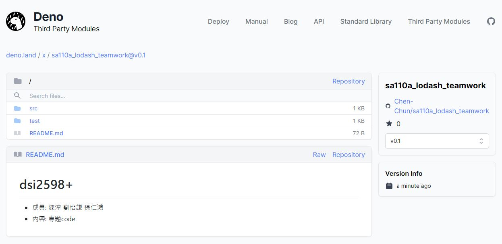

# 📝軟體工程與演算法第四週筆記20211006
## 📖 LODASH teamwork 
### 🔖 GITHUB FLOW
* 收到PR後，先測試確認是否應該收下，確認後收下合併
#### 📍 操作步驟講解 :
1. `git remote -v` : 查看節點
2. `git fetch +　協作者` : 取得原作專案最新版的內容
3. `git checkout 協作者/協作者分支` : 切換至原作者分支
4. `deno test test` : 測試test檔
5. `git branch` : 查看分支
6. `git checkout main` : 切換到主要分支
7. `git merge 協作者/協作者分支` : 合併分支到現在這個分支裡 
8. `git branch` : 查看分支
9. `deno test test` : 測試test檔
10. `git push origin main` : 回推檔案合併完成

### 🔖 GIT FLOW
#### 📍 操作步驟講解 :
1. `git checkout -b + 新分支名` : 創建新分支並切換，在此操作避免造成無法挽回的錯誤
2. `git branch`: 查看分支
3. `deno test test` : 測試test檔
4. `git add + 檔案名` : 將檔案加入索引
5. `git commit -m "版本資訊"` : 提交一個新版本
6. `git checkout + 原作者主要分支` : 切換至主分支
7. `git merge + 分支名` : 合併分支到現在這個分支裡 
8. `deno test test` : 測試test檔
9. `git push origin main` : 回推檔案合併完成

### 🔖 對版本進行標籤
```
yichien@MSI MINGW64 /d/VScode/WP/ccc/110a/sa110a_lodash_teamwork (main)
$ git tag v0.1

yichien@MSI MINGW64 /d/VScode/WP/ccc/110a/sa110a_lodash_teamwork (main)
$ git push origin v0.1
Total 0 (delta 0), reused 0 (delta 0), pack-reused 0
To github.com:yichien1019/sa110a_lodash_teamwork.git
 * [new tag]         v0.1 -> v0.1
```
## 📖 上傳函式庫到deno

#### 📍 操作步驟 : 
* Adding a module
* Select a module name
* Advanced options
* Add the webhook
You can now add the webhook to your repository.
    1. Navigate to the repository you want to add.
    2. Go to the `Settings` tab.
    3. Click on the `Webhooks` tab.
    4. Click on the `Add webhook` button.
    5. Enter the URL `https://api.deno.land/webhook/gh/sa110a_lodash_teamwork` in the payload URL field.
    6.Select `application/json` as the content type.
    7. Select `Let me select individual events`.
    8. Select only the `Branch` or `tag creation` event.
    9. Press `Add webhook`.


## 📖 補充資料
* [Git 工作流程](https://www.ruanyifeng.com/blog/2015/12/git-workflow.html)


manage access 可以加入人 cowork
## 📖 
### 🔖 


🖊️ editor : yi-chien Liu