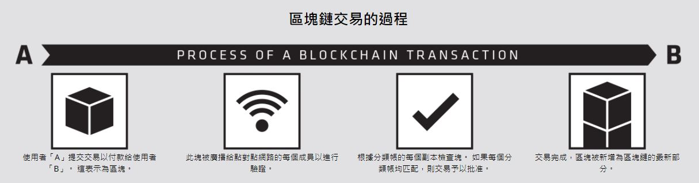
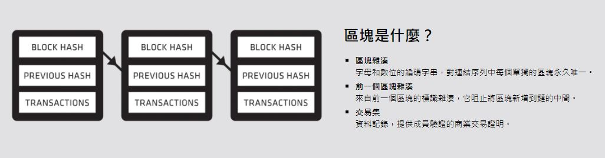
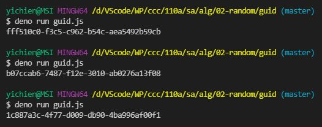
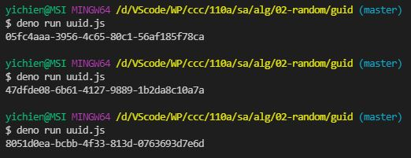
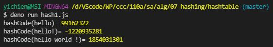
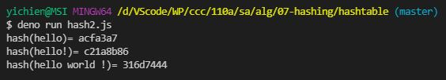
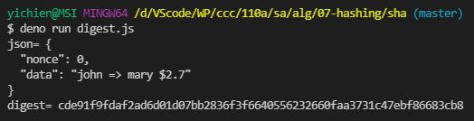

# 📝軟體工程與演算法第五週筆記20211013
## 📖 Random
### 🔖 亂數產生法
* 亂數的產生 -> 無輸入隨機產生輸出
### 🔖 雜湊產生法
* 雜湊的產生 -> 給定輸入後形成輸出，且當輸入值相同，輸出值也會相同，有機率碰撞，但是他夠大(2的256次方)，幾乎可以確定他不會碰撞
* 完全碰撞發生在 2^256 ，預期第一次碰撞為 2^128 ，所以幾乎可以確定sha不會碰撞
* 例 : git 的 commit 數是雜湊數值 
#### 📍 雜湊值必須符合兩個主要條件：
* 由雜湊值是無法反推出原來的訊息
* 雜湊值必須隨明文改變而改變

## 📖 [區塊鏈](https://zh.wikipedia.org/wiki/%E5%8C%BA%E5%9D%97%E9%93%BE)
可以想像成一個在網路上面所有人都能參與的電子記帳本，更精確來說就是「去中心化的分散式資料庫」，一種藉由密碼學串接與複製資料的技術

### 🔖 智慧術語：瞭解區塊鏈
* 區塊鏈：共用數位分類帳，提供可靠的方法來記錄由分散式成員網路中的一系列連結資料隔離艙（或「區塊」）組成的商業交易
* 加密術：安全的資訊和通信技術，在區塊鏈中用於發送和/或存儲資料，以便只有目標收件人才能存取資料。
* 雜湊：一種加密術 — 在區塊鏈中，它是指字母和數位編碼字串，對連結序列中每個單獨的區塊是永久唯一的；有時也被稱為「數位指紋」。
* 區塊：密封資料隔離艙，包含 : 

  1. 其自己的標識區塊雜湊
  2. 來自鏈序列中前一個區塊的雜湊
  3. 一組帶時間戳記的交易。
* 區塊鏈交易：由會員驗證的資料記錄，提供幾乎不可變的商業交易證明 — 例如財務或合同協議。
#### 📍 區塊鏈的三大主要特色：
1. 去中心化：在區塊鏈當中不存在第三方機構，而是由眾多礦工共同維護資料庫，假使單一礦工發生問題，也不會影響到區塊鏈的運作；相反的，我們一般常見的銀行就是具中心化性質的第三方機構。
2. 不可篡改性：簡單來說，就是區塊鏈上的資料不能被隨意更改，主要原因在於區塊鏈獨有的技術，能將經驗證後的資料放進區塊鏈當中。筆者這邊也提供幾個關鍵字：哈希值、默克爾樹、礦工算力，讀者若有興趣或想挑戰的話，都可以再自行查詢。
3. 匿名性：在區塊鏈上的世界裡，主要都是使用「英文搭配數字」作為代碼呈現，如果你有投資過加密貨幣，就可以觀察到交易紀錄都是一串英文數字的亂碼，能保護用戶的隱私。
#### 📍 種類：公有鏈、私有鏈、聯盟鏈
區塊鏈隨著不同的應用場景，可被分為三種主要類型，分別是公有鏈（Public Chain）、私有鏈（Private Chain）以及聯盟鏈（Consortium Blockchain），各自的去中心化程度與信任程度皆有所不同
1. 公有鏈 : 完全公開、透明的區塊鏈，所有人都可以在上面進行訪問、發送、接收或交易等動作，講精確一點，即所有人都能夠自由參與共識機制，是目前大多數區塊鏈的型態
2. 私有鏈 : 須有授權才可進入的區塊鏈，適合單一公司、單一機構內部使用，能提升公司內部交流的效率，是一個相當中心化的系統
3. 聯盟鏈 : 聯盟鏈介於公有鏈與私有鏈之間，結合了兩者的主要特色。相較公有鏈，能降低節點數量、提升運作效率；相較私有鏈，能減輕交易對手的風險


## 💻 程式實際操作
### 🔗 alg/02-random/guid/guid

<details>
  <summary><b>Show code</b></summary>

  ```
function s4() {
  return Math.floor((1 + Math.random()) * 0x10000).toString(16).substring(1);
}

function guid() {
  return s4() + s4() + '-' + s4() + '-' + s4() + '-' + s4() + '-' + s4() + s4() + s4();
}

console.log(guid())
  ```
</details>

#### The result of execution
```
yichien@MSI MINGW64 /d/VScode/WP/ccc/110a/sa/alg/02-random/guid (master)
$ deno run guid.js
fff510c0-f3c5-c962-b54c-aea5492b59cb

yichien@MSI MINGW64 /d/VScode/WP/ccc/110a/sa/alg/02-random/guid (master)
$ deno run guid.js 
b07ccab6-7487-f12e-3010-ab0276a13f08

yichien@MSI MINGW64 /d/VScode/WP/ccc/110a/sa/alg/02-random/guid (master)
$ deno run guid.js 
1c887a3c-4f77-d009-db90-4ba996af00f1
```

### 🔗 alg/02-random/guid/uuid

<details>
  <summary><b>Show code</b></summary>

  ```
function uuidv4() {
  return 'xxxxxxxx-xxxx-4xxx-yxxx-xxxxxxxxxxxx'.replace(/[xy]/g, function(c) {
    var r = Math.random() * 16 | 0, v = c == 'x' ? r : (r & 0x3 | 0x8)
    return v.toString(16)
  })
}

console.log(uuidv4())
  ```
</details>

#### The result of execution
* 有特定限制 `xxxxxxxx-xxxx-4xxx-yxxx-xxxxxxxxxxxx`
```
yichien@MSI MINGW64 /d/VScode/WP/ccc/110a/sa/alg/02-random/guid (master)
$ deno run uuid.js 
05fc4aaa-3956-4c65-80c1-56af185f78ca

yichien@MSI MINGW64 /d/VScode/WP/ccc/110a/sa/alg/02-random/guid (master)
$ deno run uuid.js 
47dfde08-6b61-4127-9889-1b2da8c10a7a

yichien@MSI MINGW64 /d/VScode/WP/ccc/110a/sa/alg/02-random/guid (master)
$ deno run uuid.js
8051d0ea-bcbb-4f33-813d-0763693d7e6d
```

### 🔗 alg/07-hashing/hashtable/hash1

<details>
  <summary><b>Show code</b></summary>

  ```
var hashCode = function(str) {
  var hash = 0, i, c;
  if (str.length === 0) return hash
  for (i = 0; i < str.length; i++) {
    c     = str.charCodeAt(i)
    hash  = ((hash << 5) - hash) + c // hash = hash*31 + chr = (hash*32-hash) + c
    hash |= 0 // Convert to 32bit integer, 原因： Bitwise operators treat their operands as a sequence of 32 bits (zeroes and ones), rather than as decimal, hexadecimal, or octal numbers
  }
  return hash
}
console.log('hashCode(hello)=', hashCode('hello'))
console.log('hashCode(hello!)=', hashCode('hello!'))
console.log('hashCode(hello world !)=', hashCode('hello world !'))
  ```
</details>

#### The result of execution
```
yichien@MSI MINGW64 /d/VScode/WP/ccc/110a/sa/alg/07-hashing/hashtable (master)
$ deno run hash1.js 
hashCode(hello)= 99162322
hashCode(hello!)= -1220935281      
hashCode(hello world !)= 1854031301
```

### 🔗 alg/07-hashing/hashtable/hash2

<details>
  <summary><b>Show code</b></summary>

  ```
function hash(str) {
  let hash = 5381
  let i = str.length
  while(i) {
    hash = (hash * 33) ^ str.charCodeAt(--i);
  }
  /* JavaScript does bitwise operations (like XOR, above) on 32-bit signed
   * integers. Since we want the results to be always positive, convert the
   * signed int to an unsigned by doing an unsigned bitshift. */
  return hash >>> 0;
}
console.log('hash(hello)=', hash('hello').toString(16))
console.log('hash(hello!)=', hash('hello!').toString(16))
console.log('hash(hello world !)=', hash('hello world !').toString(16))
  ```
</details>

#### The result of execution
```
yichien@MSI MINGW64 /d/VScode/WP/ccc/110a/sa/alg/07-hashing/hashtable (master)
$ deno run hash2.js 
hash(hello)= acfa3a7
hash(hello!)= c21a8b86       
hash(hello world !)= 316d7444
```

### 🔗 alg/07-hashing/hashtable/hashtable

<details>
  <summary><b>Show code</b></summary>

  ```
class HashTable {
  constructor(size) {
    this.table = new Array(size)
  }

  hashCode(str) {
    var hash = 0, i, c;
    if (str.length === 0) return hash
    for (i = 0; i < str.length; i++) {
      c     = str.charCodeAt(i)
      hash  = ((hash << 5) - hash) + c // hash = hash*31 + chr = (hash*32-hash) + c
      hash |= 0 // Convert to 32bit integer, 原因： Bitwise operators treat their operands as a sequence of 32 bits (zeroes and ones), rather than as decimal, hexadecimal, or octal numbers
    }
    return hash
  }

  size() { return this.table.length }

  slot(key) {
    return this.hashCode(key) % this.size()
  }

  get(key) {
    let i = this.slot(key)
    if (this.table[i] == null) return
    return this.table[i].find((o)=>o.key==key)
  }

  put(key, value) {
    let i = this.slot(key)
    if (this.table[i] == null) {
      this.table[i] = [{key:key, value:value}]
    } else {
      let obj = this.table[i].find((o)=>o.key==key)
      if (obj == null) {
        this.table[i].push({key:key, value:value})
      } else {
        obj.value = value
      }
    }
  }

  remove(key) {
    let i = this.slot(key)
    if (this.table[i] != null) {
      let pos = this.table[i].findIndex((o)=>o.key == key)
      if (pos >= 0) this.table[i].splice(pos, 1)
    }
  }
}

let ht = new HashTable(127)
ht.put('ccc', 'ccckmit@gmail.com')
ht.put('snoopy', 'snoopy@mail.disney.com')
console.log('get(ccc)=', ht.get('ccc'))
console.log('get(garfield)=', ht.get('garfield'))
ht.remove('ccc')
console.log('get(ccc)=', ht.get('ccc'))
  ```
</details>

#### The result of execution
```
yichien@MSI MINGW64 /d/VScode/WP/ccc/110a/sa/alg/07-hashing/hashtable (master)
$ deno run hashtable.js 
get(ccc)= { key: "ccc", value: "ccckmit@gmail.com" }
get(garfield)= undefined
get(ccc)= undefined 
```

### 🔗 alg/07-hashing/sha/hash.js

<details>
  <summary><b>Show code</b></summary>

  ```
// 參考 -- https://deno.land/std@0.63.0/hash
import { createHash } from 'https://deno.land/std/hash/mod.ts';

function hash(text) {
  const h = createHash('sha256') // const hash = createHash('md5')
  h.update(text)
  return h.toString()
}

console.log('hash(hello)=', hash('hello'))
console.log('hash(hello!)=', hash('hello!'))
console.log('hash(hello world !)=', hash('hello world !'))

  ```
</details>

#### The result of execution
```
yichien@MSI MINGW64 /d/VScode/WP/ccc/110a/sa/alg/07-hashing/sha (master)
$ deno run hash.js 
hash(hello)= 2cf24dba5fb0a30e26e83b2ac5b9e29e1b161e5c1fa7425e73043362938b9824
hash(hello!)= ce06092fb948d9ffac7d1a376e404b26b7575bcc11ee05a4615fef4fec3a308b       
hash(hello world !)= a4bf1f6be616bf6a0de2ff6264de43a64bb768d38c783ec2bc74b5d4dcf5f889
```

### 🔗 alg/07-hashing/sha/digest

<details>
  <summary><b>Show code</b></summary>

  ```
import { createHash } from 'https://deno.land/std/hash/mod.ts';

function hash(text) {
  const h = createHash('sha256')
  h.update(text)
  return h.toString()
}

let record = {
  nonce: 0,
  data: 'john => mary $2.7',
}

let json = JSON.stringify(record, null, 2)
console.log('json=', json)
const digest = hash(json)
console.log('digest=', digest)
  ```
</details>

#### The result of execution
* 在區塊鍊中挖nonce，填入的hash前面有足夠多的前導零
```
yichien@MSI MINGW64 /d/VScode/WP/ccc/110a/sa/alg/07-hashing/sha (master)
$ deno run digest.js 
json= {
  "nonce": 0,
  "data": "john => mary $2.7"
}
digest= cde91f9fdaf2ad6d01d07bb2836f3f6640556232660faa3731c47ebf86683cb8
```

### 🔗 

<details>
  <summary><b>Show code</b></summary>

  ```
  ```
</details>

#### The result of execution
```
```

### 🔗 

<details>
  <summary><b>Show code</b></summary>

  ```
  ```
</details>

#### The result of execution
```
```

## 📖 補充資料
* [深入瞭解區塊鏈技術的意義](https://www.amd.com/zh-hant/technologies/blockchain-explained)
沒輸入產生亂數 
hash2 太簡單 
hashtable 大小固定127是質數 因為碰撞率
碰撞完全在2^256，預期第一次碰撞 2^128 幾乎可以確定sha不會碰撞
就算有問題 加倍2^512


digest
挖礦->猜數字
mining
足夠前導0->5個


```
yichien@MSI MINGW64 /d/VScode/WP/ccc/110a/sa/alg/07-hashing/sha (master)
$ deno run hash.js
Download https://deno.land/std/hash/mod.ts
Warning Implicitly using latest version (0.111.0) for https://deno.land/std/hash/mod.tsod.ts
Download https://deno.land/std@0.111.0/hash/mod.ts
Download https://deno.land/std@0.111.0/hash/hasher.ts
Download https://deno.land/std@0.111.0/hash/_wasm/hash.ts
Download https://deno.land/std@0.111.0/encoding/base64.ts
Download https://deno.land/std@0.111.0/hash/_wasm/wasm.js
Download https://deno.land/std@0.111.0/encoding/hex.ts
Check file:///D:/VScode/WP/ccc/110a/sa/alg/07-hashing/sha/hash.js
hash(hello)= 2cf24dba5fb0a30e26e83b2ac5b9e29e1b161e5c1fa7425e73043362938b9824     
hash(hello!)= ce06092fb948d9ffac7d1a376e404b26b7575bcc11ee05a4615fef4fec3a308b    889
hash(hello world !)= a4bf1f6be616bf6a0de2ff6264de43a64bb768d38c783ec2bc74b5d4dcf5f889
```


https://www.facebook.com/ccckmit/videos/352484563296857
19:00