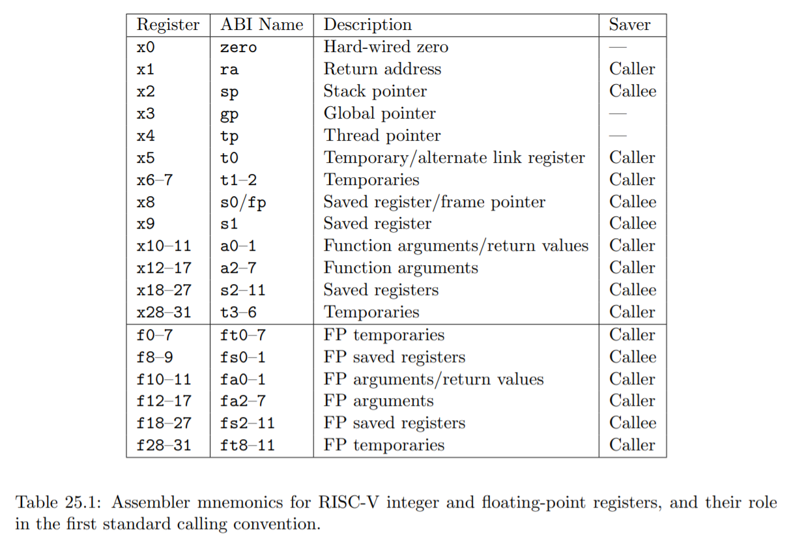

# 📝軟體工程與演算法第九週筆記20211110
## 📖 RISC-V 處理器的架構
一個暫存器有兩個別名 
一個是編號(x0、x1) EX.x1 又稱 ra (return address) ，因為用來儲存返回位址。x2 又稱 sp (stack pointer) ，是堆疊暫存器
一個是ABI name(zero、ra、sp) EX.x0 的別名為 Zero，因為該暫存器為唯讀，而且數值永遠都是 0

RV32V : SIMD 單指令多資料


## 📖
## 📖
## 📖
### 🔖 
#### 📍 
## 💻 程式實際操作
### 🔗 

<details>
  <summary><b>Show code</b></summary>

  ```
  ```
</details>

#### The result of execution
```
```

## 📖 補充資料

https://github.com/riscv2os/riscv2os


